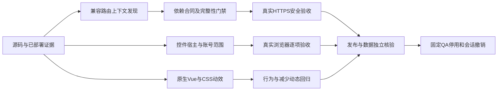

# 剩余验收与生产动效：设计

```mermaid
flowchart LR
 A[源码与已部署证据] --> B[兼容路由上下文发现]
 B --> C[依赖合同及完整性门禁]
 C --> D[真实HTTPS安全验收]
 A --> E[控件宿主与账号范围]
 E --> F[真实浏览器逐项验收]
 A --> G[原生Vue与CSS动效]
 G --> H[行为与减少动态回归]
 D --> I[发布与数据独立核验]
 F --> I
 H --> I
 I --> J[固定QA停用和会话撤销]
```

不改业务鉴权合同与数据库结构。路由工具优先使用框架提供的有效路由上下文；额外依赖不明时停止执行，不猜认证机制。UI状态依靠真实store/响应；动效仅表示已发生变化，不引入假的阶段/延迟完成或自动发起请求。生产错误分阶段反馈，工具失败保留收据且不重放已发写请求。
