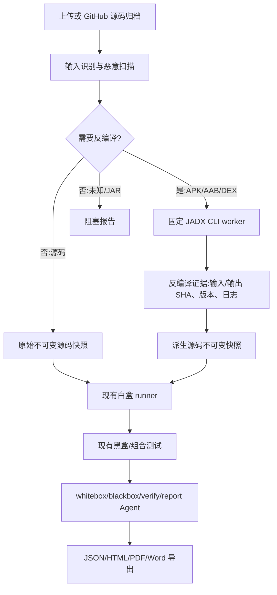

# DESIGN：反编译白盒测试优化

## 总体架构



## 分层设计

### 输入识别层

- 依据安全归档成员路径、扩展名、magic bytes 和 ZIP 内部结构识别 `source_archive`、`android_apk`、`android_aab`、`android_dex`、`java_jar`、`unknown_binary`。
- APK/AAB 必须是 ZIP 容器且包含 Android 相关入口；DEX 必须匹配 `dex\n` magic。扩展名与 magic 冲突时拒绝。
- 纯文本成员、GitHub codeload 源码和普通压缩归档只返回 `skip`。

### 决策层

- 固定 allowlist：`jadx` 只服务 Android 输入；`skip` 服务源码；`unsupported` 服务 JAR/未知二进制。
- Agent 可以把决策作为可见事件展示，但不能修改 `tool`, `argv`, `timeout`, `network` 或输出路径。
- 每次决策写入脱敏 fingerprint 和原因，便于重复失败改道而不原样重试。

### 执行层

- 专用 worker 使用固定 JADX CLI 版本/镜像 digest，原始输入只读挂载，输出目录为空且有文件数/总字节/超时限制。
- stdout/stderr 进入截断日志制品，命令只保存参数摘要，不保存宿主路径或凭据。
- 成功必须有至少一个 `.java`/`.kt` 文件且输出 SHA 可重算；否则失败关闭。

### 沙箱与报告层

- 派生源码重新打包为新的 `source_sha256`，继续使用现有 `SandboxEnvironment` 和 worker profile。
- `evidence.decompilation` 与 `evidence.worker_result` 并列；报告模板明确两类证据边界。
- 导出 API 只读取持久化报告，不在下载请求中再次运行反编译器。

## 接口/数据协议

```json
{
  "status": "skipped|planned|succeeded|failed|unsupported",
  "input_kind": "source_archive|android_apk|android_aab|android_dex|java_jar|unknown_binary",
  "tool": "none|jadx",
  "tool_version": "1.5.6",
  "input_sha256": "64-hex",
  "output_sha256": "64-hex-or-empty",
  "output_file_count": 0,
  "exit_code": 0,
  "reason": "中文非敏感原因",
  "artifact_refs": ["decompilation-manifest.json", "decompilation.log"]
}
```

## 异常策略

- 输入 magic/扩展名冲突、压缩包损坏、恶意扫描失败、工具缺失、超时、非零退出、空输出、输出超限：`failed` 或 `unsupported`，不创建“通过”结论。
- Agent 服务/API key 不可用不影响确定性选择；报告角色标记未执行，保持事实证据。
- 沙箱/生产 worker 不可用时停止在 `blocked`，保留原始制品和决策证据，禁止宿主机回退。
