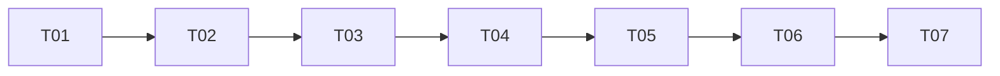

# TASK：反编译白盒测试优化

| 任务 | 内容 | 依赖 | 验收 |
| --- | --- | --- | --- |
| T01 | 远端基线、生产版本漂移记录、备份工作树 | 无 | AC-01 |
| T02 | 输入类型识别与 JADX 决策协议 | T01 | AC-02/03 |
| T03 | 固定反编译 runner 配置和证据校验 | T02 | AC-04/05 |
| T04 | 接入源码归档/沙箱前置阶段 | T02/T03 | AC-06 |
| T05 | 报告四格式证据呈现和导出回归 | T04 | AC-07 |
| T06 | 定向单测、构建和本地沙箱验证 | T02-T05 | AC-08 |
| T07 | 生产备份、发布、公网业务验收和独立复核 | T06 | AC-08 |

## 输入契约

- T02 输入安全归档成员/文件名/bytes；不得读取宿主任意路径。
- T03 输入 T02 的固定决策和已 pin 的工具配置；不得接收任意命令。
- T04 输入原始归档 SHA 和执行上下文；原始源码不可变。
- T05 输入结构化证据和现有报告模型；不改变导出权限。

## 输出契约

- 结构化决策/证据、反编译 manifest/log 制品、派生源码 SHA、测试与报告结果。
- 每个任务必须有自动化测试或明确 blocked 证据；不得以历史快照数字代替当前运行结果。
