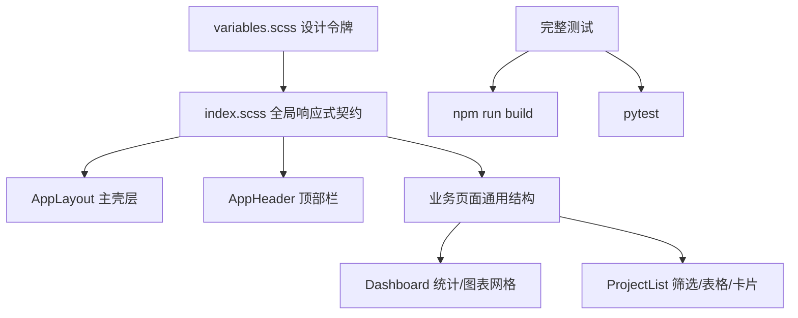
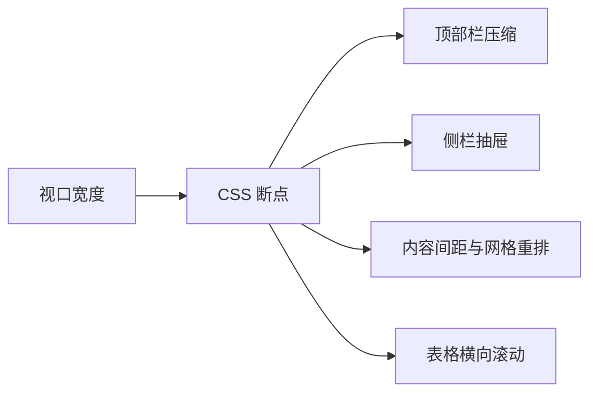

# 响应式布局与完整测试设计文档

## 架构图

## 分层设计

| 层 | 设计 |
|----|------|
| 全局层 | 统一 `.page-head`、`.page-actions`、`.filter-bar`、`.pagination-wrap` 的响应式行为 |
| 壳层 | 使用 `100dvh`、`min-height: 0` 和分断点 padding |
| 顶部栏 | 宽屏保留搜索与用户信息，窄屏降级为图标按钮 |
| 数据密集区 | 表格最小宽度 + 容器横向滚动 |
| 高频页面 | 仪表盘统计卡与项目卡按视口宽度重排 |

## 数据流

## 异常处理

- 表格字段过多时不隐藏关键列，通过局部横向滚动处理。
- 弹窗、Element Plus 组件由全局选择器限制最大宽度，避免超出视口。
