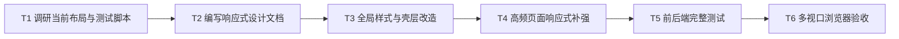

# 响应式布局与完整测试任务拆分

## 任务依赖图

## 原子任务

| 编号 | 输入契约 | 输出契约 | 验收标准 |
|------|----------|----------|----------|
| T1 | 说明文档、布局组件、测试脚本 | 改造范围 | 明确不重写业务流程 |
| T2 | 需求和范围 | 6A 文档 | 文档可追溯 |
| T3 | 全局样式、AppLayout、AppHeader | 响应式壳层 | 小屏不重叠 |
| T4 | Dashboard、ProjectList | 高频页面适配 | 网格、表格、筛选条可用 |
| T5 | 项目测试脚本 | 测试输出 | 前后端命令完整执行 |
| T6 | 本地浏览器 | 多视口记录 | 桌面/平板/手机均有证据 |
