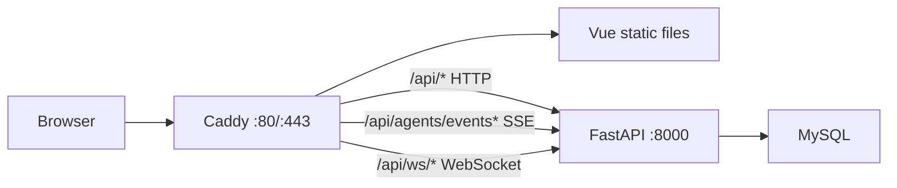
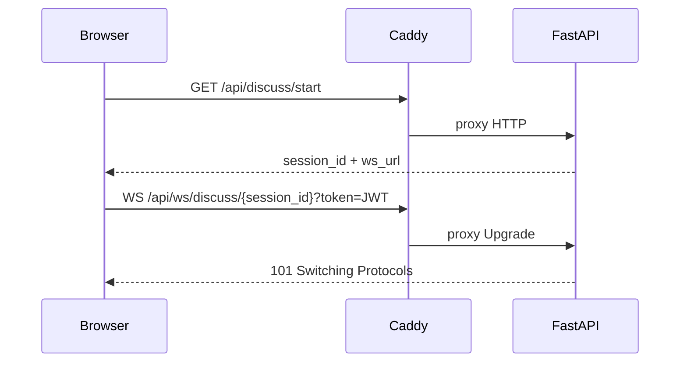

# 圆桌讨论 WebSocket 线上修复 - Design

## 架构

```mermaid
flowchart LR
    Browser["Browser"] --> Caddy["Caddy :80/:443"]
    Caddy --> Frontend["Vue static files"]
    Caddy -->|"/api/* HTTP"| Backend["FastAPI :8000"]
    Caddy -->|"/api/agents/events* SSE"| Backend
    Caddy -->|"/api/ws/* WebSocket"| Backend
    Backend --> MySQL["MySQL"]
```

## 数据流

```mermaid
sequenceDiagram
    participant U as Browser
    participant C as Caddy
    participant B as FastAPI
    U->>C: GET /api/discuss/start
    C->>B: proxy HTTP
    B-->>U: session_id + ws_url
    U->>C: WS /api/ws/discuss/{session_id}?token=JWT
    C->>B: proxy Upgrade
    B-->>U: 101 Switching Protocols
```

## 异常处理

- token 缺失或非法时后端关闭 WebSocket 并记录拒绝原因。
- 前端连接失败时保留重连按钮和自动退避重连。
- Caddy 显式代理块避免 WebSocket 与普通 API、SSE 代理意图混在一起。
