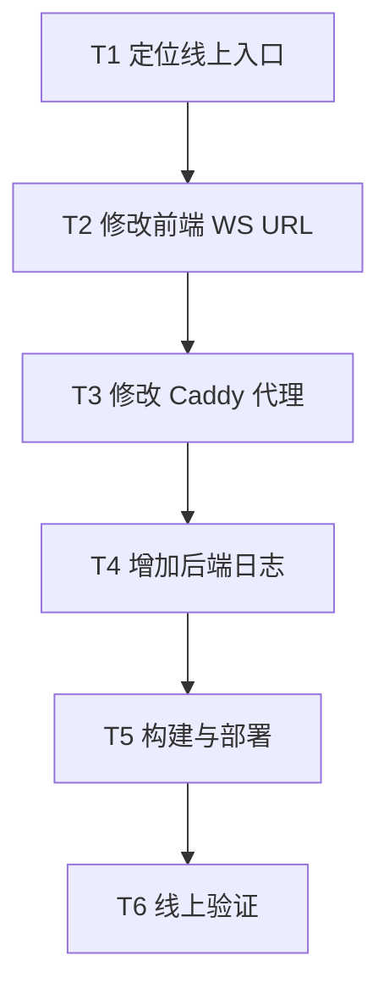

# 圆桌讨论 WebSocket 线上修复 - Task

## 原子任务

| 任务 | 输入 | 输出 | 验收 |
| --- | --- | --- | --- |
| T1 | 线上日志、Caddy 配置 | 定位结论 | 明确失败层级 |
| T2 | `ws_url` 返回值 | 前端按返回路径建连 | `npm run build` 通过 |
| T3 | Caddyfile | 显式代理 API/SSE/WS | Caddy 容器启动成功 |
| T4 | WebSocket 入口 | 无敏感信息日志 | 后端启动成功 |
| T5 | 当前代码 | 部署到 `/opt/code-review` | 容器健康 |
| T6 | 公网入口 | 验证结果 | HTTP/SSE/WS 全部可达 |
