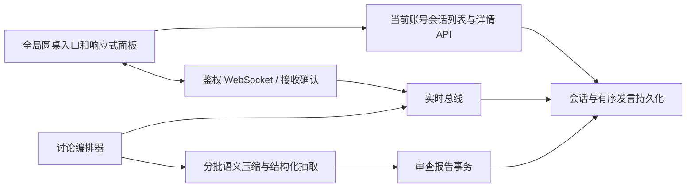

# 圆桌讨论持续会话与压缩：设计

## 分层与数据流

现有 `ReviewTask` 继续承载最终审查报告，圆桌会话和发言另存为按账号隔离的会话记录；`DiscussionBus` 保留实时推送职责。前端通过当前账号会话列表和详情恢复面板，WebSocket 按服务端单调序号补齐消息。服务端重启时，对未完成任务显式标记为中断，避免前端永远显示运行中。

## 进度与状态契约

`progress` 由 `phase`、`completed_units`、`total_units`、`current_round`、`speaker_code`、`seq` 组成。轮次/发言阶段按完成成员计数；总结、结构化抽取批次和报告保存作为独立阶段显示。初始、暂停、运行、中断、失败、部分完成与完成均使用不同文案；前端不推算服务端未给出的工作完成率，也不把重连后的早停伪装为最后一轮。

## 长内容与错误处理

原始源码和完整发言进入持久化记录，不因模型预算而删除。编排器按模型上下文和输出预算选择有界批次，生成带来源序号/源码位置的压缩中间结果，再对所有批次进行问题合并与去重。每个批次记录覆盖范围；任一批次失败或结构化 JSON 不完整时，保留已完成证据并明确部分状态。`finish_reason=length` 触发有界重试/细分，而非直接宣称无问题。

小菱运行时保留完整 transcript/checkpoint，在发送模型前为被省略条目分块语义压缩，标注原始条目序号与摘要来源哈希；压缩调用自身也应计入用量审计。保留最近完整的工具调用/结果对和图像引用。未完整结束的压缩或主模型响应不可供工具执行；提高输出预算后仍未完成则返回显式未完成状态。工具结果的实时 UI 预览可以简短，持久化供模型继续处理的值必须完整脱敏保留。圆桌读取工具按游标给出受预算限制的完整块及后续游标。

WebSocket 输入先校验所有权、会话状态及控制器，再持久化、广播和回 ACK。被拒绝的输入以错误回执通知，不能占据序号或进入历史。重连、列表与详情只查询当前认证账号可见数据。

## 五分钟规则

会话完成后的交互窗口、自动关闭和禁言状态迁移在用户确认后补全；不以客户端定时器作为最终权限判断。
