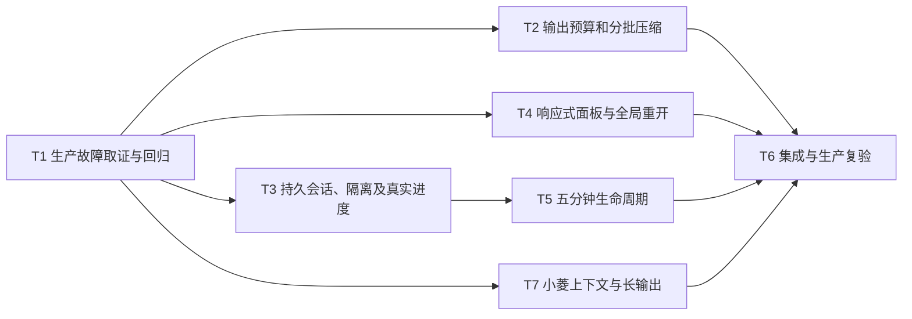

# 圆桌讨论持续会话与压缩：原子任务

| 任务 | 输入与依赖 | 输出与验收 | 负责范围 |
|---|---|---|---|
| T1 复现 | v4.0.6 生产只读记录、截图、候选源码 | 锁定 `#182` 的结构化抽取截断、手机头部挤压、结束后发送竞态；失败回归可稳定复现 | 协作审查 |
| T2 压缩 | T1、现有 DeepSeek 调用与圆桌编排器 | 保留原文和证据序号、分批抽取与覆盖检查；模型输出不足不得伪装完整；目标回归通过 | 后端模型流程 |
| T3 会话 | T1、现有 Bus/API/WS | 当前账号会话列表/详情、按序持久化、真实进度、输入 ACK/拒绝、跨账号禁止、重启中断提示 | 后端会话流程 |
| T4 界面 | T1、现有 Agent 中心和全局小菱入口 | 320/390/768/桌面可读可点；跨页重开、恢复、进度和错误状态可见 | 前端 |
| T5 生命周期 | 用户对五分钟规则的回答、T3/T4 | 服务器截止时间与输入权限、边界时刻/多标签页测试 | 前后端 |
| T6 验收发布 | T2-T5 全部通过 | 定向和全量测试、生产备份/发布一致性、真实 Safari 多样本复验、独立复核与知识库收据 | 集成 |
| T7 小菱对话压缩 | T1、现有 Responses checkpoint 与工具结果账本 | 长对话语义压缩、末尾约束与来源可追溯、输出超预算安全处理、圆桌读取游标、模型与账本结果不静默截断；正常/边界/失败回归 | 小菱运行时与工具服务 |

T2、T3、T4、T7 可并行；T5 依赖用户确认与会话契约，T6 依赖全部实现。
