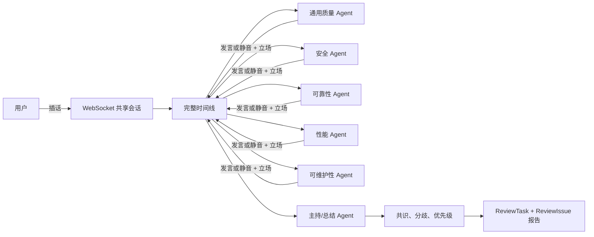
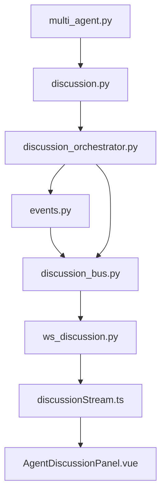

# 圆桌讨论群聊语义完善 - 设计文档

## 整体架构

## 分层设计

- 领域模型层：`DiscussionTurn` 表达发言/静音、立场、回应对象和轮次。
- 编排层：构造共享历史，调用各画像完成自主决策，过滤静音后总结与抽取问题。
- 传输层：沿用 DiscussionBus 和 WebSocket，不新增消息类型，保证重连回放。
- 展示层：参会者最近状态、立场标签、回应目标、静音状态行。
- 持久化层：沿用现有 ReviewTask/ReviewIssue，不新增表字段。

## 模块依赖

## 数据流

1. 预检创建包含五个审查子 Agent 的会话。
2. 主持 Agent 开场后，编排器按轮次依次请求每个 Agent 决策。
3. Agent 接收代码、画像、完整时间线和用户最新指示，返回 JSON 决策。
4. 编排器验证决策；非法枚举归一化，非 JSON 文本降级为普通发言。
5. 发言或静音都成为 `DiscussionTurn`，进入总线、回放缓存和共享历史。
6. 用户插话广播后同步进入编排器共享历史。
7. 主持 Agent仅基于有效发言与用户发言总结；结构化问题抽取排除静音记录。

## 异常处理

- JSON 解析失败：将原始文本作为 `speak + neutral`。
- 空发言：归一化为 `silent`，使用简短原因说明。
- 非法立场/回应对象：归一化为 `neutral/None`。
- LLM 调用失败：保留失败提示发言并发送 FAILED 事件，不能伪装成自主静音。
- 用户在暂停时插话：记录到共享历史；暂停状态不被自动解除。
- 生产部署失败：保留远端备份并恢复本任务白名单文件，重建原服务。

