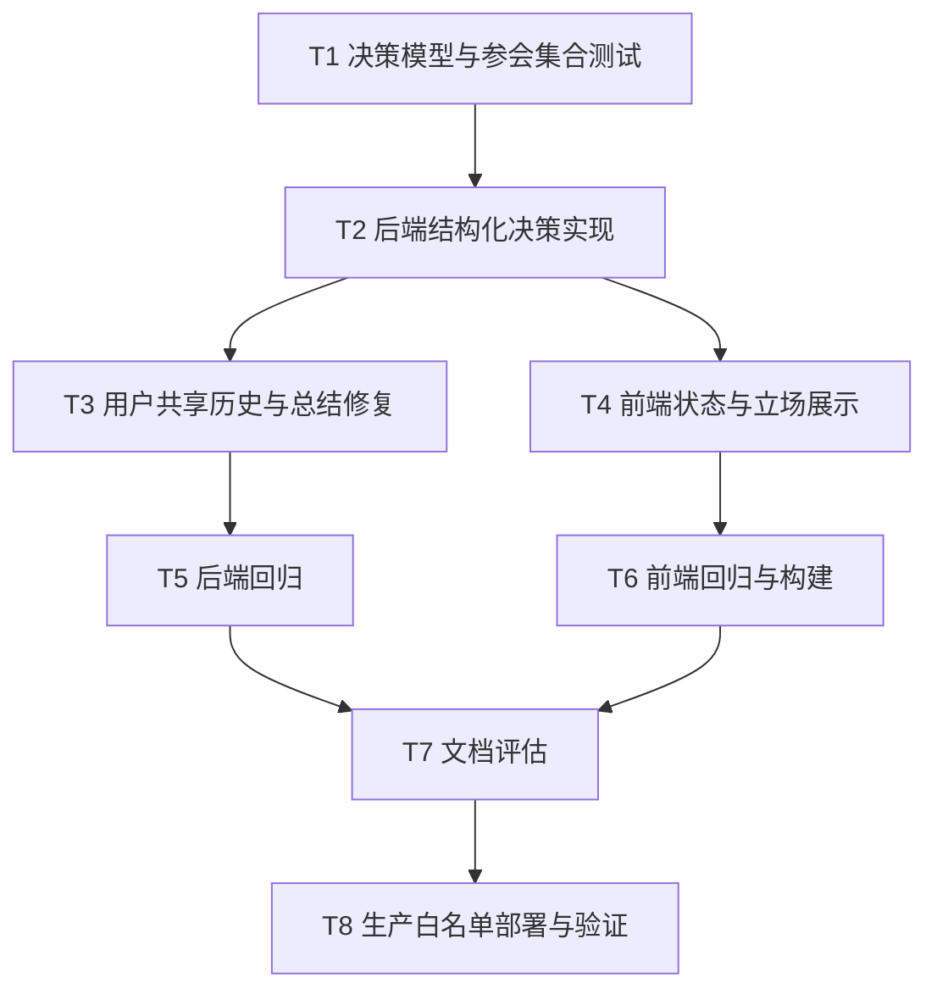

# 圆桌讨论群聊语义完善 - 原子任务

## 任务依赖图

## T1 决策模型与参会集合测试

- 输入契约：现有 `multi_agent.py`、`DiscussionTurn`、编排器测试 fake。
- 输出契约：覆盖五 Agent 全量参会、结构化发言、静音、非法响应降级的失败测试。
- 实现约束：测试不访问外部 LLM 或网络。
- 验收标准：新增测试在实现前准确失败，实现后通过。

## T2 后端结构化决策实现

- 输入契约：T1 测试、现有 DeepSeek `call_raw`。
- 输出契约：`SpeakerDecision` 解析、`DiscussionTurn` 新字段、编排循环发布决策。
- 实现约束：字段向后兼容；所有函数有函数级注释。
- 验收标准：发言、静音、立场、回应对象均可序列化和回放。

## T3 用户共享历史与总结修复

- 输入契约：现有 WebSocket 用户插话和 DiscussionBus 回调。
- 输出契约：用户发言进入 `all_turns`；总结与问题抽取排除静音、包含用户上下文。
- 实现约束：不重复向前端发布用户气泡。
- 验收标准：用户原话出现在后续 Agent 与总结 Prompt。

## T4 前端状态与立场展示

- 输入契约：扩展后的 `DiscussionTurn`。
- 输出契约：参会者最近状态、立场标签、回应对象、紧凑静音记录。
- 实现约束：兼容旧帧；桌面和移动端不溢出；按钮语义不变。
- 验收标准：TypeScript 类型检查与构建通过。

## T5-T6 自动化回归

- 输入契约：完成的本地代码。
- 输出契约：后端定向 pytest/ruff/compileall，前端 vitest/vue-tsc/build 结果。
- 实现约束：失败必须修复后重跑。
- 验收标准：所有指定命令退出码为 0。

## T7 文档评估

- 输入契约：测试证据和代码 diff。
- 输出契约：更新验收、最终总结、TODO 和根说明文档。
- 验收标准：实现与文档契约一致，无未声明范围扩张。

## T8 生产部署与验证

- 输入契约：本地验证通过的白名单文件，远端 `/opt/code-review` 运行环境。
- 输出契约：远端备份、SHA-256 一致性、Backend/Frontend 新镜像和线上验证证据。
- 实现约束：不覆盖无关文件，不写入凭据，不执行破坏性 Git 命令。
- 验收标准：容器健康、API 正常、WebSocket 握手和新增协议验证通过。

