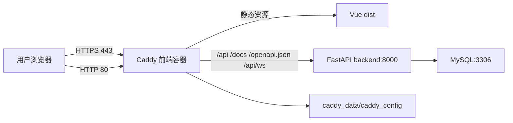

# DESIGN_域名HTTPS配置

## 架构图

## 接口契约

- `https://lijiadong.cn/`：Vue SPA。
- `https://lijiadong.cn/api/*`：反代到 `backend:8000/api/*`。
- `https://lijiadong.cn/api/ws/*`：反代到后端 WebSocket。
- `https://lijiadong.cn/docs`：反代到 FastAPI Swagger。
- `https://lijiadong.cn/openapi.json`：反代到 FastAPI OpenAPI JSON。

## 异常策略

- DNS 未指向服务器：Caddy 会启动，但证书签发会失败并定期重试。
- 443 安全组未放行：服务器本地正常，公网 HTTPS 超时，需要在腾讯云控制台放行 TCP 443。
- 证书频繁失败：先修复 DNS，再查看 `docker compose logs frontend`。
