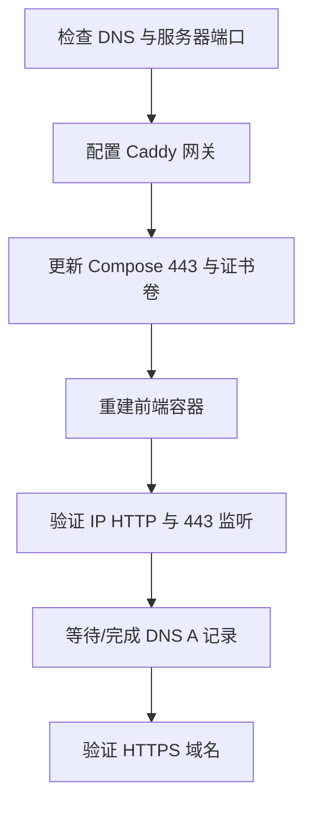
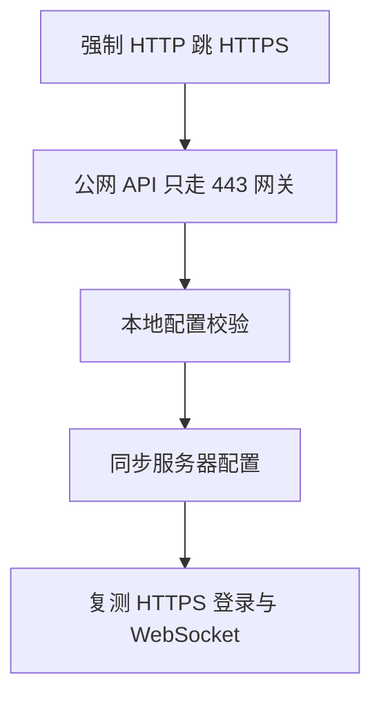

# TASK_域名HTTPS配置

| 任务 | 状态 | 验收 |
|---|---|---|
| T1 DNS 与端口检查 | 已完成 | 根域最终解析到服务器，服务器 443 可监听 |
| T2 配置 Caddy 网关 | 已完成 | 新增 `frontend/Caddyfile` |
| T3 更新 Compose | 已完成 | `frontend` 暴露 `443` 并挂载 Caddy volume |
| T4 重建前端容器 | 已完成 | 容器正常启动 |
| T5 验证服务器访问 | 已完成 | IP HTTP 正常，443 监听 |
| T6 DNS A 记录 | 已完成 | `@ A 81.70.251.90` |
| T7 HTTPS 验证 | 已完成 | `https://lijiadong.cn` HTTP 200 |

## 2026-06-12 复核新增任务

| 任务 | 状态 | 验收 |
|---|---|---|
| H1 HTTP 全量跳转 | 已完成 | `frontend/Caddyfile` 中 `http://` 兜底改为 301 到 `https://lijiadong.cn{uri}` |
| H2 公网端口收敛 | 已完成 | `deploy/docker-compose.yml` 中 `8000`、`3307` 改为 `127.0.0.1` 绑定 |
| H3 本地配置校验 | 已完成 | `bash -n deploy/deploy.sh` 与 `docker compose config --quiet` 通过 |
| H4 同步服务器配置 | 阻塞 | 当前 SSH 能建立 TCP 但 banner 超时，`rsync` 无法完成 |
| H5 线上 HTTPS 复测 | 阻塞 | 待 H4 完成后复测 `/`、`/docs`、`/api/auth/login`、`/api/ws/*` |
