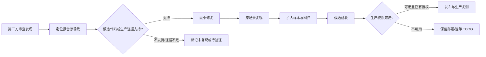

# 设计：外部审查问题核验与修复

## 核验与修复流程

## 模块设计

- 报告映射：以 R2–R10 编号和第 1 轮遗留逐项登记；每项保存现象、报告描述、复现范围、证据来源、修复状态和盲区。
- 前端安全策略：Nginx 容器模板负责生产静态站点响应头；HTML 去除 inline event handler；本地静态合同测试约束 CSP 指令。真正的运行时验收必须通过启动已构建镜像的 Nginx 并检查响应头/浏览器控制台。
- Agent 上下文预算：集中预算函数与 Agent 自身发送字节 guard 必须使用一致的序列化/字节口径；规则分片失败时应继续无损拆分并明确覆盖状态。
- 外部运维：腾讯云安全组、8888 监听归属、Certbot timer、SSH 配置和版本由云/主机控制面负责，不通过产品容器 Nginx 推断或修改。

## 异常与回滚

- CSP enforce 导致资源/Agent 实时连接回归时，候选先修兼容性；生产变更需遵循现有 release 备份及回滚流程。
- SSH 更新和云防火墙变更必须保持已有管理连接恢复方案；本轮没有服务器控制权限，禁止尝试盲改。
- 上下文压缩覆盖不足要返回范围/失败标记，不能以静默截断冒充压缩成功。
