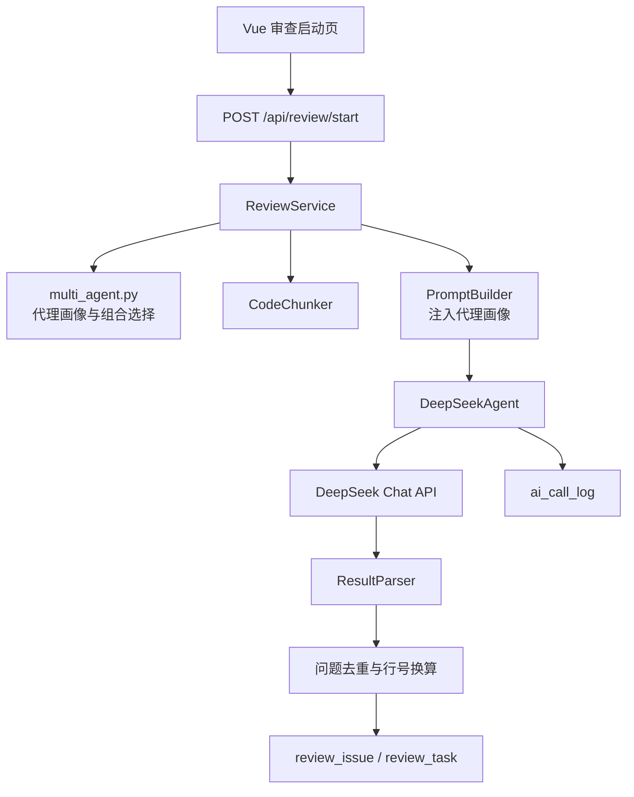

# DESIGN_多Agent优化

## 1. 架构图

## 2. 核心组件

| 组件 | 职责 |
| --- | --- |
| `ReviewAgentProfile` | 描述单个审查代理的名称、关注范围、问题类型和额外指令 |
| `get_agent_profiles` | 将审查类型映射为代理组合 |
| `format_agent_section` | 将代理画像格式化为 Prompt 段落 |
| `ReviewService._review_one_file` | 按文件分片,再按代理循环调用 DeepSeek |
| `_issue_fingerprint` | 对多代理重复发现的问题做轻量去重 |
| `_absolute_line` | 将分片内相对行号转为原文件绝对行号 |

## 3. 数据流

1. 用户选择审查类型。
2. 后端创建 `review_task`,根据类型选择代理组合。
3. 每个文件先分片,每个分片按代理画像构造 Prompt。
4. DeepSeek 返回 JSON 后解析为结构化问题。
5. 服务层转换行号、去重、批量写入 `review_issue`。
6. 任务收尾统计问题数量、评分和摘要。

## 4. 异常处理

- 单个代理或分片失败只记录 warning,不阻断其他代理和文件。
- 所有 DeepSeek 调用仍写入 `ai_call_log`。
- 若所有代理都未返回问题,任务仍可成功结束,评分为 100。

