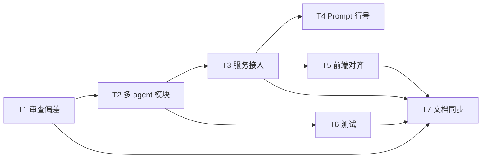

# TASK_多Agent优化

## 1. 原子任务

| ID | 任务 | 输入 | 输出 | 状态 |
| --- | --- | --- | --- | --- |
| T1 | 审查现有 AI 链路和文档偏差 | `backend/app/ai`, `docs` | 偏差清单 | 已完成 |
| T2 | 新增多 agent 画像模块 | 现有 AI 包 | `multi_agent.py` | 已完成 |
| T3 | 审查服务接入代理组合 | `ReviewService` | 多代理调用、去重、摘要 | 已完成 |
| T4 | 修正 Prompt 行号规则 | Prompt 模板 | 相对行号约定 | 已完成 |
| T5 | 前端审查入口对齐 | 审查页面和路由 | 类型、状态、跳转修正 | 已完成 |
| T6 | 新增单元测试 | pytest | 11 个新增测试通过 | 已完成 |
| T7 | 同步项目文档 | 根说明和 docs | 文档口径对齐 | 已完成 |

## 2. 依赖图

