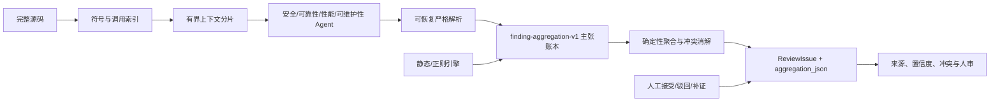
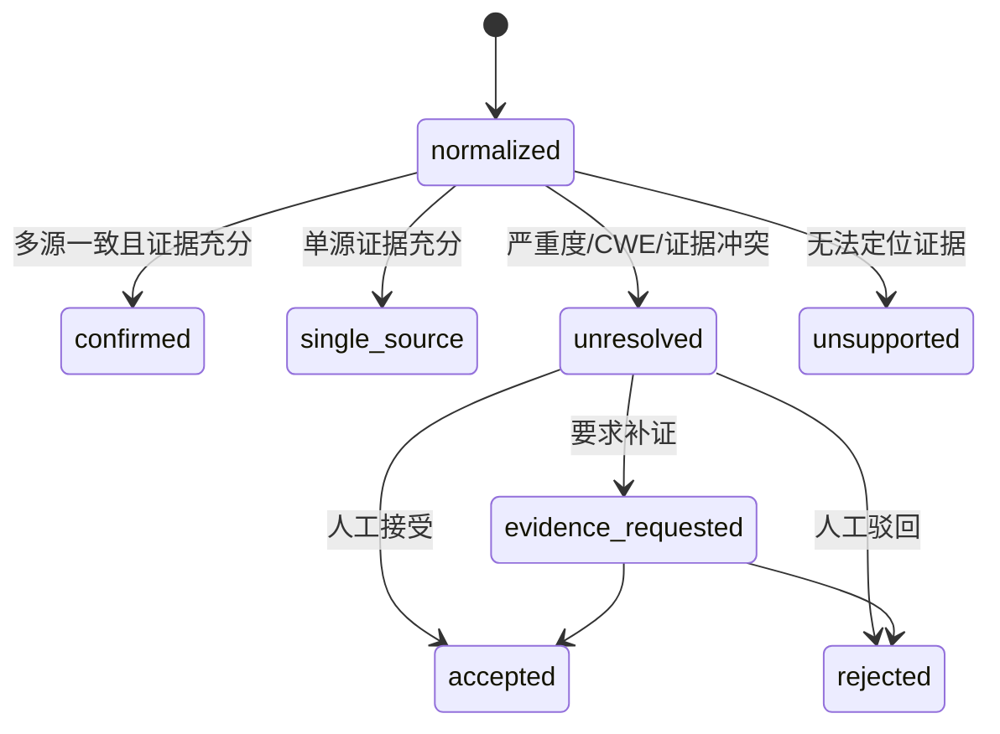
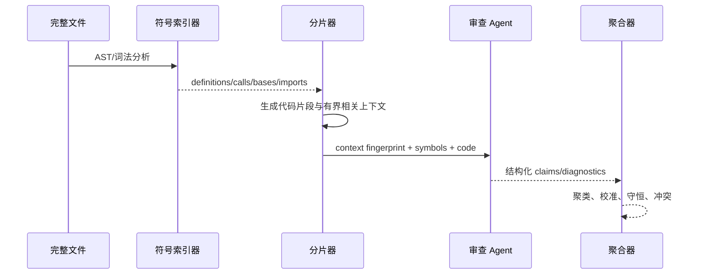

# Design：多智能体可信审查与 FlyTrap 退役

## 总体架构

## 聚合状态机

## 模块设计

### `app/ai/result_parser.py`

- 严格输出协议、严重度别名映射和逐项输入诊断。
- 非数组或全无效输出明确报错，混合输出隔离坏项并保留好项。
- 不接受模型提供的 `confirmation_count` 作为事实。

### `app/ai/finding_aggregator.py`

- 物理位置、证据和规则身份的完全连接聚类。
- 严重度/置信度绑定同一 claim 后计算，保留全部原始主张。
- 生成 risk score、证据等级、冲突、守恒映射和人审要求。
- 输出顺序与输入排列无关。

### `app/ai/code_chunker.py`

- 保留 `chunk_code` 兼容入口。
- 扩展 `CodeChunk`，新增文件级 `SymbolIndex` 和稳定上下文渲染。
- Python AST 失败和非 Python 语言走词法降级，结果标出解析模式和诊断。

### `review_service.py`

- 阶段 1 独立 Agent 输出先严格解析并转为 claim。
- 删除阶段 2/3 的二次 LLM 汇总，由版本化确定性聚合器生成 canonical 结果。
- 聚合失败时保留各 Agent 有效结果并进入人工复核；单 Agent/单分片失败不阻断其他结果。
- 任务详情返回结构化聚合摘要。

### 数据模型与 API

`review_issue` 新增：

- `aggregation_version`
- `evidence_quality`
- `conflict_status`
- `human_review_status`
- `risk_score`
- `aggregation_json`

新增 `PUT /api/issues/{id}/review-decision`，决议为 `accepted/rejected/evidence_requested`，写入独立人审记录并复用项目写权限。

### 前端

- 审查任务页显示总问题、待人审、冲突和多源确认统计。
- 问题详情显示聚合风险、校准置信度、证据等级和真实来源主张。
- 待人审问题提供接受、驳回、要求补证操作；失败后保留当前页面并显示可重试错误。

## 跨分片数据流

## 错误与回退

| 故障 | 行为 | 是否继续 |
| --- | --- | --- |
| 单条输出格式错误 | 隔离并记录 diagnostic | 是 |
| 一个 Agent 全部失败 | 其他 Agent 与静态结果继续 | 是 |
| 所有 LLM 输出无效 | 静态结果继续，事件流和日志明确报告 Agent 失败 | 是 |
| 符号 AST 解析失败 | 使用词法索引，标注降级 | 是 |
| 单分片模型失败 | 记录缺口，其他分片继续 | 是 |
| 聚合内部异常 | 原始 claims 落账、全部待人审 | 是 |
| 数据库迁移失败 | 发布回滚，不切换当前版本 | 否 |
| FlyTrap 已退役 | 返回 retired，不访问上游 | 是 |

生产宿主机同时停止并禁用 `flytrap-agent.service`、`flytrap-sync.service` 与
`flytrap-agent-cert-renew.timer`；静态续签 service 保留但不再被 timer 触发。

## 安全与隐私

- `aggregation_json` 仅保留最小证据片段、哈希、位置和来源标识。
- 不存储隐藏系统提示词、完整源码、API Key 或远端凭据。
- 人审操作沿用项目写权限并记录操作者和时间。
