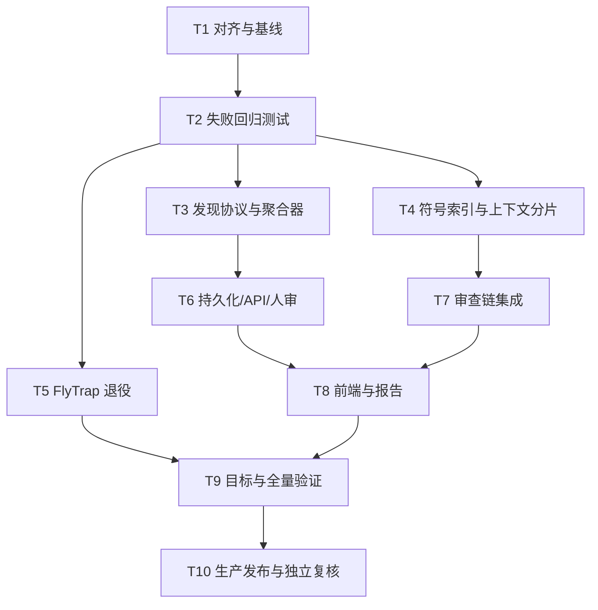

# Task：多智能体可信审查与 FlyTrap 退役

## T1 对齐与基线

- 输入：用户需求、项目文档、当前源码、生产只读状态。
- 输出：6A 前四阶段文档和可复现实证。
- 验收：边界、兼容策略、FlyTrap 退役语义无歧义。

## T2 失败回归测试

- 覆盖非数组 issues、部分坏条目、全坏输出、严重度/置信度错配、虚假确认数、顺序稳定性、跨分片调用和 FlyTrap retired。
- 验收：测试在旧实现上按预期失败，错误已被复现。

## T3 发现协议与聚合器

- 输入：多 Agent 原始结果和静态发现。
- 输出：`finding-aggregation-v1`、确定性聚合、诊断和守恒账本。
- 验收：真实来源唯一计数，冲突进入人工复核，不产生合成主张。

## T4 符号索引与上下文分片

- 输入：完整源码、语言、分片阈值。
- 输出：符号索引、调用边、继承关系、有界上下文和指纹。
- 验收：嵌套函数、跨片调用、类继承、语法错误降级和大文件全覆盖测试通过。

## T5 FlyTrap 退役

- 输入：配置、监控服务、运维执行器和生产 systemd 状态。
- 输出：默认禁用、retired 响应、告警收敛和可逆停服步骤。
- 验收：不再调用 FlyTrap 日志/服务，不影响其他安全数据源。

## T6 持久化/API/人审

- 输入：聚合结果。
- 输出：迁移、ORM、Schema、任务聚合摘要和人审接口。
- 验收：迁移可逆；接受/驳回/补证有权限、审计时间和状态闭环。

## T7 审查链集成

- 输入：上下文分片和聚合器。
- 输出：普通审查、安全哨兵和多 Agent 协同使用统一契约。
- 验收：部分失败继续、全部无效通过事件/日志显式报错且不影响静态结果。

## T8 前端与报告

- 输入：新增 API 字段。
- 输出：任务聚合摘要、问题来源/冲突/人审 UI 和报告字段。
- 验收：桌面与移动布局无重叠；错误可重试；来源、置信和冲突可见。

## T9 目标与全量验证

- 后端单元/集成/迁移/全量测试。
- 前端组件测试、类型检查、构建和浏览器截图复验。
- 聚合排列稳定性、真值样本、长文件覆盖与 FlyTrap 禁用回归。

## T10 生产发布与独立复核

- 发布前数据库和应用备份，记录哈希和回滚版本。
- 运行迁移并发布新版本；公网 health/ready/API/页面复验。
- 停止并禁用 FlyTrap 两个服务及证书续签 timer，关闭旧集成告警；不删除历史数据。
- 子代理独立重读代码、测试、数据库和生产状态，发现错误则退回修复。
