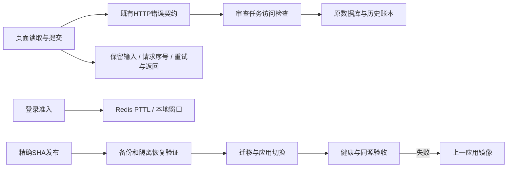

# 失败恢复与复测核验：设计

```mermaid
flowchart LR
 UI[页面读取与提交] --> HTTP[既有HTTP错误契约]
 HTTP --> API[审查任务访问检查]
 API --> DB[原数据库与历史账本]
 UI --> FEEDBACK[保留输入 / 请求序号 / 重试与返回]
 LOGIN[登录准入] --> RATE[Redis PTTL / 本地窗口]
 DEPLOY[精确SHA发布] --> BACKUP[备份和隔离恢复验证]
 BACKUP --> SWITCH[迁移与应用切换]
 SWITCH --> CHECK[健康与同源验收]
 CHECK -->|失败| ROLLBACK[上一应用镜像]
```

复用当前Vue/Element Plus与服务访问函数，不引入通用框架。任务端点仅转换项目访问404，页面保留结构化错误请求编号。读取用序号拒绝迟到响应；提交锁绑定真正异步结束。Redis以PTTL向上取整给Retry-After，不重置仍有效的固定窗口。部署保持已有维护锁、备份、精确镜像与回滚门禁，补阶段反馈与故障矩阵。
