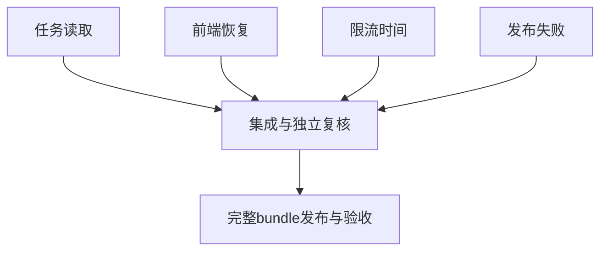

# 失败恢复与复测核验：执行拆分

| 任务 | 输入 | 输出与验收 | 负责与依赖 |
|---|---|---|---|
| 任务读取与404 | 既有访问模型、详情页面 | 隔离JWT/SQLite与前端红绿测试，正确返回入口 | usage_attribution，独立 |
| 前端失败恢复 | 页面原函数拒绝/迟到复现 | 表单锁、保留输入、部分读取与竞态回归 | permission_matrix，独立 |
| 限流与安全事实 | 原Lua、本地时钟、注册Schema | 真实隔离Redis及登录链测试，最小时间修复 | security_catalog，独立 |
| 部署失败矩阵 | 真实发布与回滚脚本 | 无生产故障注入，阶段、退出码、回滚与状态断言 | 主代理，独立 |
| 集成与发布 | 以上通过和独立复核 | 全量检查、完整bundle、生产门禁与证据 | 主代理，依赖前四项 |
| 交互验收与动效 | 普通会话、选型答复 | 更新逐账号矩阵，单独实施获确认动效 | 待必要输入 |

