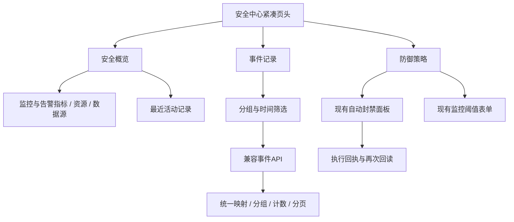

# 安全中心界面设计

## 接口契约

事件 API 新增可选 `event_group=all|activity|inspection`，默认 `all` 保留原行为。`activity` 包含告警、权限审计、策略变更、有实际记录的防御动作及异常采集/巡检；`inspection` 包含成功的只读采集、正常巡检，以及明确成功、已核验且原始回执中 active_blocks/recent_blocks/errors 均为空数组的规则核验。未知回执、字段缺失或任何封禁/异常记录保留在活动中。结果先归一化再计数分页，单来源读取上限保留明确提示。

## 交互与视觉规范

- 页头压缩为工作摘要；四个指标同一网格、主次文字层级统一。
- 以 8px 为主要间距节奏，正文约 14px，辅助文字不小于 12px；重要标题和状态允许换行。
- 操作列位置稳定；详情采用原生可键盘访问的折叠区。时间、状态、动作不跟随标题长度漂移。
- 页面标签有明确选中态和键盘操作。策略面板保持挂载，切换标签不重复初始化。
- 草稿修改后显示“未保存”，刷新只更新实际状态；用户明确重置或保存回读后再同步表单。
- 320/375/390/768/1280/1440 宽度检查溢出和控件遮挡。手机视口验证与实体手机验证分别记录。

## 异常处理

模块独立重试，未知数量用横线显示；请求代次阻止旧响应覆盖新筛选；不以旧成功状态掩盖新读取失败。权限保持后端最高管理员门禁。
