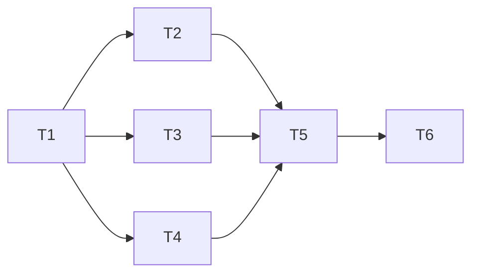

# 安全中心界面任务

| 编号 | 任务与输入 | 输出与验收 | 负责方 |
| --- | --- | --- | --- |
| T1 | 真实原页面、现有组件和接口 | 截图与问题范围定位 | 主代理 |
| T2 | 时间线映射与现有分页 | 向后兼容分组、边界与权限测试 | 后端子代理 |
| T3 | 主页面与现有令牌 | 三分区、指标/资源/事件布局、行为测试 | 页面子代理 |
| T4 | 自动封禁面板现有契约 | 规范化表单、折叠、草稿保护与回读测试 | 策略子代理 |
| T5 | T2–T4 的候选改动 | 独立复核、测试、类型和构建结果 | 主代理与独立复核 |
| T6 | 已验证候选 | 已授权发布、运行版本核对、普通 Safari 复测截图 | 主代理 |

只在已附加工作树中修改，避免混入主目录的无关变更。生产高影响策略不作为视觉测试的操作目标。
