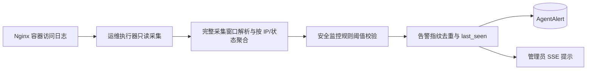

# 安全监控重复 HTTP 错误告警架构

## 分层

## 接口契约

`nginx_attack_events` 接收 `since_hours`、`limit`、`failure_threshold`。返回 `http_failures_by_ip`（来源、状态码计数、总数）、`source_line_limit`、`source_truncated`。原始 `recent` 仍有展示上限；告警不依赖它。

监控服务只接受合法 IPv4/IPv6 和允许的状态码，并重新按 `status_counts` 求和后判断阈值。告警指纹为 `nginx:http_failures:{ip}`，类别 `scanner`、严重度 `warning`。SSE 仅面向现有管理员告警通道；不使用 `ip_attribution`、不调用防火墙能力。

## 异常处理

- 日志命令失败仍由既有运维采集失败机制报告。
- 达到 30,000 行上限时，以部分窗口的计数下界告警，并告知管理员需核对完整窗口。
- 非法 IP、状态码或计数不参与告警。
- 多轮命中同一开放指纹只刷新详情和 `last_seen`，不重复弹窗。
