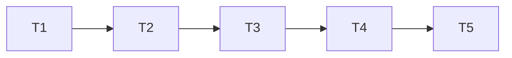

# 安全监控重复 HTTP 错误告警任务拆分

| 子任务 | 输入契约 | 输出与验收 | 依赖 |
| --- | --- | --- | --- |
| T1 复现旧规则漏报 | 生产匿名化 39 条样本、当前规则代码 | 隔离数据库无告警的红测与生产只读证据；不生成攻击流量 | 无 |
| T2 完善执行器聚合 | T1；Nginx 状态分类；读取窗口参数 | 对全部采集输出聚合 400/403/444，受 `recent` 展示限制和行数边界保护 | T1 |
| T3 完善规则与设置 | T2 输出契约；现有 AgentAlert/SSE | 默认 20 次/小时 warning、白名单独立、去重、仅告警 | T2 |
| T4 回归与发布 | 隔离测试、生产只读发布门禁 | 后端/执行器/全量测试通过；可追溯的生产 SHA 与下一轮监控证据 | T2、T3 |
| T5 数据复核 | 发布后真实运行状态 | 独立复查 release、测试账号、告警/运行摘要和 #234 快照；证据不含账号/IP 明文 | T4 |

任务依赖：

