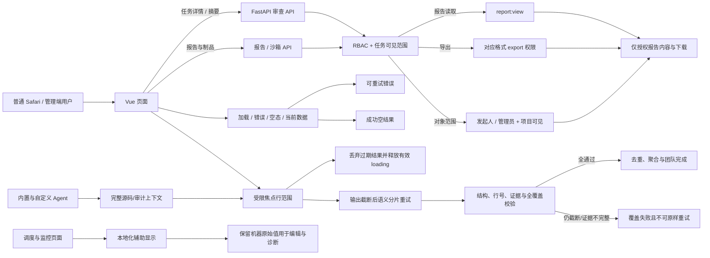

# 完整体验问题修复：设计

## 整体架构

## 报告授权和内容隔离

- 报告查看 API 要求 `report:view`，并验证报告可用状态、发起人/管理员范围及项目当前读取权限。
- 每个导出路由先验证 `report:view` 和对应 `report:export:<format>`，再通过同一对象范围校验；拒绝不得先查询/渲染内容。
- 沙箱 `review_report` 摘要在没有 `report:view` 与 owner/admin 范围时不进入环境详情；下载路由再次强校验。其他测试工件沿用项目成员规则。
- 任务详情提供 `can_view_report` 只读布尔值；任务列表摘要按同样的报告访问能力掩蔽报告内容。UI 依据此值隐藏入口，但 API 始终独立鉴权。

## 前端请求状态与并发

- 管理页面分离 `loading / error / empty / data`，失败有原位重试；只有成功空数组才展示空态。
- 搜索、筛选、翻页、管理工作台模式切换和账号切换使用 request sequence/account generation 防止过期响应回写或清理新页面加载态；Agent 知识子请求额外绑定当前模式与 Agent。
- 用户目录及角色目录并行拉取；只有点开角色编辑时才等待角色目录，避免慢 RBAC 请求阻塞用户列表。
- 圆桌分页结果按列表代次校验；同账号列表刷新使分页结果过期时仍复位该账号的 `moreLoading`。账号切换立即清空旧 sessions、`nextOffset` 和 `moreLoading`；旧账号 finally 只能在身份代次仍匹配时修改状态。
- 审计卡片详情按钮使用传播边界，键盘打开详情不触发行折叠。

## 移动端审批

- 审批表外层使用命名且可聚焦的横向滚动区域，提供“左右滑动查看更多列”提示；固定业务列和审批操作语义不变。
- 视口缩小时通过 `scrollWidth > clientWidth` 与键盘/触屏检查确认容器真实可滚动。自动化视口测试不替代 iOS/Android 真机验收。

## 运维显示和统计语义

- 计划解释器只翻译已验证的调度语法：`manual`、`daily@H:MM`、`hourly@MM` / `hourly@*:MM`、`interval@Ns` / `interval@Nm`；Cron 前端校验与 APScheduler 兼容，包含数值范围和月份/星期英文缩写，拒绝或未命中的值返回原文。
- 编辑控件继续保存原始表达式，中文释义作为相邻提示；不将解释结果写回数据库。
- `tool_status`、`job_runs` 与奖励事件为历史累计；`approval_status` 表示审批事项当前状态分布；`open_alerts` 仅表示当前未关闭告警。审批状态列使用“状态”、计数列“事项数”；工具执行为“结果 / 次数”。
- reviewer 在前端、服务端拒绝消息与 Agent 提示中统一显示为“审查员”；数据库 role name、接口 code `reviewer`、role ID 和权限不变。

## 异常与验证策略

- 缺少 RBAC 权限返回既有 403 语义；对象范围外报告不泄漏，沿用隐藏对象响应；不因 UI 隐藏弱化后端检查。
- API 错误保留可重试路径；失败响应不渲染成空列表。账号切换后取消/丢弃请求结果。
- 所有后端权限矩阵与前端异步交错均用隔离数据测试；生产只读 Safari 验收仅导航与读取，不提交业务变更。
- 发布前端、后端须同一 commit。生产发布依项目清单执行备份验证、健康/就绪、release identity、业务只读冒烟与观察检查。

## AI 输出截断恢复

- 不把 `finish_reason=length` 的部分文本或可解析 JSON 当作完成，也不通过“预算加大后仍失败”无限重复相同源码。
- 内置 `code_reviewer` 首次全片输出截断后，保留完整源码上下文，只将回答范围切成连续、互不遗漏的行区间；单区间再次截断时递归二分，最多 32 次恢复调用、深度 8。每个结果都校验 JSON/问题结构和焦点行号，完成全部原始行范围后才聚合；分片评分按既有 severity-deduction 规则从合并问题确定性计算。
- 正式审查沿用现有源码分片与可用且经来源核验的符号/调用上下文摘要；输出仍截断时再按源码行二分，保留起始行偏移与审查配置，完成后把分片局部行号换算回原文件。摘要锚点只能证明来源覆盖，不能证明语义无损。
- 已发布自定义 Agent 在输出预算重试仍截断时，拆分当前 CodeChunk，保留父分片符号上下文和源码 SHA；每个 issue 仍须通过逐字源码证据及行号校验。动态分片总数受 128 限制，深度受 8 限制。
- 任何最小行范围仍被截断、模型结果结构无效、行号超出焦点或覆盖出现空洞时返回 `coverage_incomplete`/显式失败，禁止生成“零问题”成功结果；Agent Team 收到已穷尽语义分片的失败后标记 `retryable=false`，避免再次提交同一源码。
- 百万 token 真实供应商语义理解仍需独立验证；上述候选测试使用 mock，不能证明真实模型对压缩上下文完整理解。
