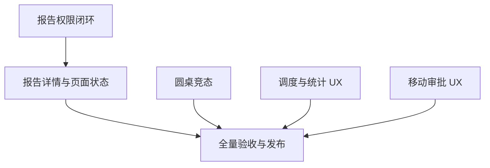

# 完整体验问题修复：任务拆分

| 任务 | 输入与实现边界 | 输出与验收 | 状态 |
|---|---|---|---|
| T1 报告权限闭环 | 报告查询、旧/新格式导出、`review_report` 制品、任务详情与列表摘要；保持权限与对象范围一致 | 缺查看权/格式权/对象权拒绝且不泄漏；有权路径保留；普通测试制品仍可用 | 实现、隔离回归、全量测试和 v4.0.31 发布完成；生产未触发导出/下载写路径 |
| T2 管理列表状态 | AI 日志、系统审计、用户管理和治理工作台模式切换；对列表/详情异步响应做代次保护 | pending 不闪空态；错误显示重试；成功空态正确；旧账号、旧列表或旧页面模式不能覆盖新数据或结束新加载态 | 实现及回归完成；管理员 Safari 实际加载用户、AI 日志和审计列表 |
| T3 圆桌账号与刷新竞态 | 全局圆桌面板的账号切换、同账号刷新、分页迟到请求 | 过期分页结果丢弃并释放当前账号 loading；旧账号 finally 不清新账号状态；五分钟追问进度不回退 | 候选实现及同账号刷新/跨账号乱序自动化回归通过；未做生产真实多账号追问 |
| T4 计划、角色与统计说明 | 真实生产 schedule/task code、`observability_service.overview` 粒度和 reviewer 文案 | 计划验证按后端大小写、Cron 字段范围及 APScheduler 月/周别名；展示释义不改原始值；审批状态及计数列名准确 | 实现、APScheduler 隔离回归及生产只读页面核对完成 |
| T5 移动端审批 UX | 审批表的聚焦、命名、横向滚动和操作列 | 320/375/390px 自动化视口约束测试；明确真机未测范围 | Playwright 视口测试通过；未执行生产 Safari 或 iOS/Android 真机点击 |
| T6 端到端验收与文档 | 全量测试、构建、lint、release、普通 Safari 只读点击、知识 Harness | 记录候选与生产不同层级证据、失败重试、版本/SHA/健康状态和未覆盖项 | v4.0.31 正式发布；健康/就绪、ops-check、普通 Safari 复验及文档收尾完成 |

## 依赖与顺序

## 执行约束

1. 每项已声明为缺陷的问题必须先由失败回归或生产只读复现证明，再实施修复并重复原场景。
2. 只有有源码/数据/测试证据的结论进入“确认”；其余明确记为未验证，不升级为漏洞。
3. 生产用户、权限、审批、Agent、报告及项目数据保持只读；不能通过点击任何会保存或改变状态的控件来制造验证数据。
4. 完整测试、构建和发布按同一候选 commit 记录；外部 Redis/供应商模型/移动真机未运行时逐项说明。
