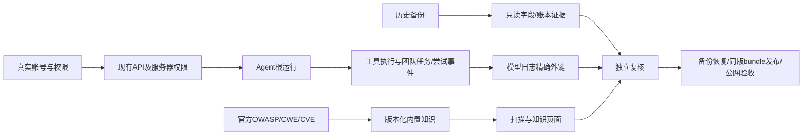

# 完整待办与漏洞知识更新：设计

```mermaid
flowchart LR
  U[真实账号与权限] --> A[现有API及服务器权限]
  A --> R[Agent根运行]
  R --> T[工具执行与团队任务/尝试事件]
  T --> L[模型日志精确外键]
  O[官方OWASP/CWE/CVE] --> K[版本化内置知识]
  K --> S[扫描与知识页面]
  B[历史备份] --> V[只读字段/账本证据]
  V --> Q[独立复核]
  L --> Q
  S --> Q
  Q --> D[备份恢复/同版bundle发布/公网验收]
```

各任务复用原模块，权限与知识/归因分别提交文件范围，主代理整合。迁移为兼容性新增nullable外键，不强行回填。数据查询使用只读事务，不传出原始源码、凭据或说明内容。无效来源或不可验证关系显式报错，旧异常保持原样。
