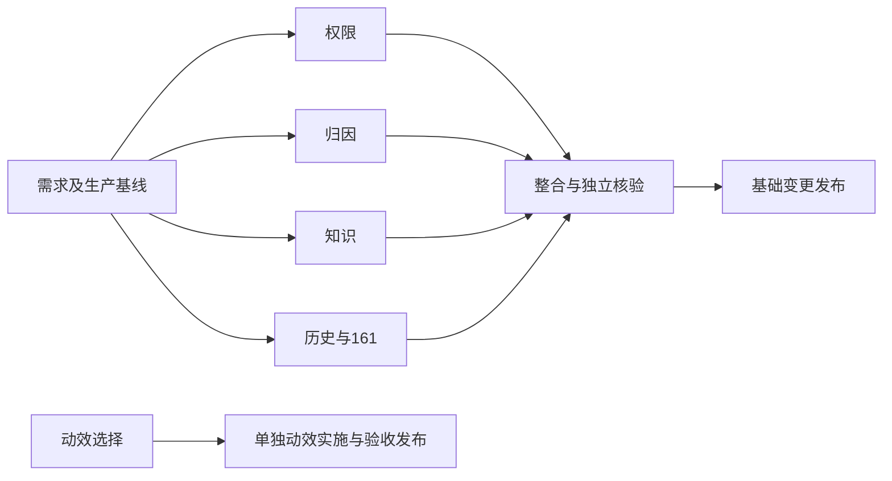

# 完整待办与漏洞知识更新：任务与依赖

|任务|输入/约束|输出与验收|责任|
|---|---|---|---|
|权限矩阵|现有router/RBAC/项目成员契约|角色正反向HTTP及前端按钮清单/交互结果|permission_matrix|
|用量外键|现有run/tool/team/task/event|真实调用链关联、迁移、未知usage、回归|usage_attribution|
|漏洞知识|官方OWASP/CWE/CVE与现有种子|版本化知识、扫描映射、来源快照、页面回归|security_catalog|
|历史账本|生产只读快照和事件|逐条异常/孤儿关系分类，状态不改|主代理|
|项目161|已验证隔离前dump|八字段/整行hash前后比较|主代理|
|动效|用户选型答复、现有组件|独立变更、真实状态驱动、减少动效验收|待选型|
|整合发布|以上测试证据、可审查Git SHA|bundle校验、备份恢复、迁移、公网与UI|主代理|
|独立复核|原始证据和最终产物|复算/打回/最终矩阵|子代理复核|

# 发布前追加范围

用户追加的导出、Agent数量、审查任务161、功能导航命名、登录冷却五项纳入同轮。输入契约、分工依赖和验收见[追加五项问题修复](追加五项问题修复.md)。原待办继续执行；追加完成前暂停提交与生产发布。
