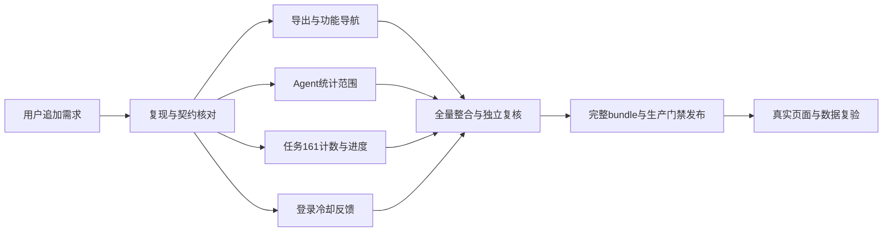

# 追加五项问题修复

用户在本轮发布前追加五项问题，保留此前全部待办及 Git bundle 发布授权。五项修复已随3.8.6/0a14b5359a446ab7b447e10c061b1ebbe6d15e29发布；最终3922后端、994前端通过。3897/962仅为追加需求前基线。

## 对齐与实现边界

|问题|当前事实与方案|验收|
|---|---|---|
|工作台导出无反应|当前生产3.8.5按钮为“导出统计报告”，源码已有onWeeklyReport；通过Blob新窗口输出，不会另发请求。改成明确的HTML文件下载，保留当前账号数据及区间说明、完整性和导出权限门禁|真实挂载按钮触发下载，文件名/内容/错误提示/URL释放；生产实际下载单独记证据|
|Agent 5/19/17|区分本人可见运行记录、目录数量和MetaGPT内置适配范围，先核对真实来源再统一同范围统计或注明范围|普通账号、管理员、无调用记录、自定义Agent的计数与权限回归|
|审查任务161问题总数/分级与未知进度|与项目161不同；只读复核任务及问题聚合，修复字段映射与展示。历史缺失不能编造成功状态或时间|真实聚合与接口、前端合计一致，兼容缺失字段；不改历史状态|
|全局搜索命名|采用用户建议中的“功能导航”，维持现有权限过滤和页面导航能力|按钮、弹窗、输入框、空态一致，Cmd/Ctrl+K保留|
|登录冷却提示|保留现有限流策略，错误响应返回可核验剩余秒数，前端倒计时与重试提示；不靠正确密码绕过限流|本地真实登录接口与可控时钟验证阈值、Retry-After和恢复，不攻击生产账号|

## 依赖与执行

导出实现沿用应用既有 Blob + a.download 模式，不新增依赖。浏览器不保证 download 属性一定导致保存成功，因此提示“已请求下载”，不声称客户端已保存。官方依据：[MDN download](https://developer.mozilla.org/en-US/docs/Web/API/HTMLAnchorElement/download)、[MDN window.open](https://developer.mozilla.org/en-US/docs/Web/API/Window/open)。

## 实测边界

本轮在生产普通成员页面确认导出按钮存在并可见，显示“导出统计报告”，五项数据读取成功。真实点击被 Browser Use 工具安全策略拦截：新窗口导航不允许；这不是生产站点状态错误或用户拒绝，不能通过其他浏览器、脚本或间接执行绕过。该次不能记为真实导出通过，也不能据此确认用户描述的旧按钮无处理器。保留代码修复、挂载测试与实际下载的证据区别。

前置知识收据：`20260907-074843-7fb34db565`，hard_gate=ready。与原始收据一起保留，本文件不向知识库回填推断。

## 导出与功能导航验证

新增下载行为用例先在旧实现产生两项准确失败：仍调用 window.open，且没有下载失败反馈。原始结果为 `证据/追加问题-导出下载红测.xml`。完成修改后，仪表盘、顶部导航与权限组合 **63 项通过**，文件名、HTML MIME、下载调用、提示、失败清理、延迟回收，以及报告真实范围/统计值/标题转义均有断言。无权限或数据不完整时不会触发下载；HTML下载明确要求report:export:html，只有PDF权限不能下载HTML。定向 ESLint 通过。

功能导航沿用 Cmd/Ctrl+K 和现有权限过滤，按钮、弹窗、输入标签改为“功能导航”；空态提示到项目管理搜索项目名称。不新增全库搜索接口。

## 报告格式按钮的补充修复

完整重读后端契约：报告生成、下载分别需要 JSON/HTML/PDF/Word 格式权限；HTML 预览和浏览器打印属于已有报告查看能力。前端现在按格式权限与来源支持格式的交集显示按钮，并在处理器重复校验。仅查看账号不再发送额外的 issue:view 查询。自动生成参数先消费，等待报告来源确认后才生成 HTML，读取失败或领域报告不会误发请求。

新增四个用例在旧实现准确失败（报告格式权限红测.xml），修改后本页19项通过。延迟响应测试曾因测试夹具缺失必填files字段造成渲染异常，补齐真实响应结构后回归通过；未通过修改生产数据契约掩盖失败。原生 Element Plus 与 Pinia 的独立补充验收由权限复核代理执行。
