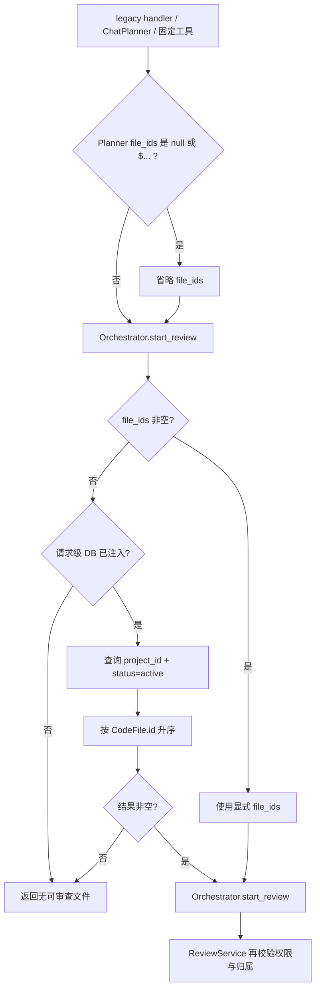

# 小助手启动审查契约对齐 - 设计文档

## 数据流

## 接口契约

- 工具输入：`project_id: int`，`file_ids?: list[int]`；JSON Schema 仅把 `project_id` 标为 required。
- Planner 规范化：`start_review.file_ids` 为 `null` 或以 `$` 开头时删除该字段；`"all"` 等其他字符串仍校验失败。
- 输出成功：Markdown 含任务 ID、审查类型、文件数和状态。
- 输出失败：缺项目 ID或无 active 文件时返回 `AgentResult(success=False)`。
- 单一职责：只有 Orchestrator 查询并解析缺省文件；ChatAssistant 和 Planner 不直接查询 `CodeFile`。
- 异常策略：数据库查询异常记录 warning，并按无可用文件安全失败。
