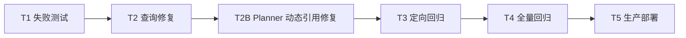

# 小助手启动审查契约对齐 - 原子任务

## T1 失败测试

- 输入：旧综合 handler 测试、SQLite `db` fixture。
- 输出：显式 ID、自动 active 查询、deleted 排除用例。
- 验收：实现前旧用例和自动查询用例准确失败。

## T2 查询修复

- 输入：`CodeFile.status` 字符串契约。
- 输出：active 过滤、稳定排序、函数注释。
- 验收：T1 全部通过。

## T3-T4 回归

- 输入：完成的代码与测试。
- 输出：Ruff、compileall、ChatAssistant 定向和后端全量结果。
- 验收：零失败。

## T2B Planner 动态引用修复

- 输入：生产 Planner 原始输出 `"file_ids":"$[0].files[].id"`。
- 输出：规范化动态引用、禁止 prompt 占位符、保留任务名。
- 验收：动态引用改为服务端文件解析，任意其他非数组字符串仍被拒绝。

## T5 生产部署

- 输入：白名单文件与既有备份。
- 输出：Backend 新镜像、健康检查、线上对话审查任务。
- 验收：容器健康，对话以单步 Planner 调用创建非空文件任务，任务名保留且最终成功。
