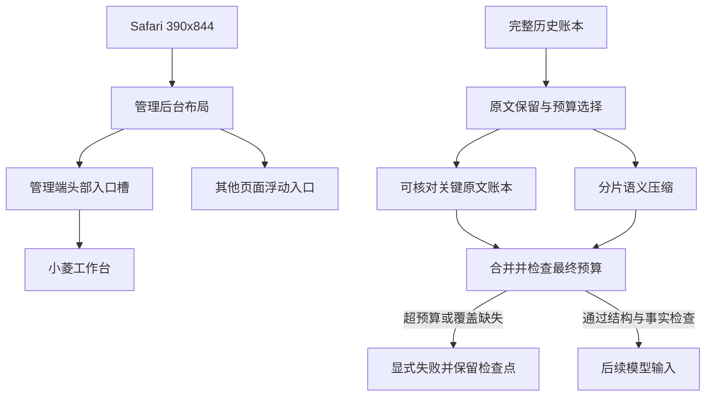
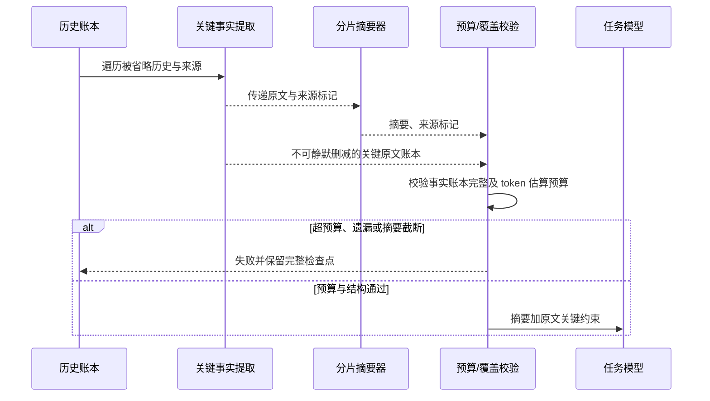

# 小菱上下文与移动端复测：设计

## 组件关系

## 移动端入口

管理员路由、窄视口时，将小菱入口放入管理员页头现有用户操作行的专属槽位；其他页面及桌面端维持悬浮入口。展开的对话面板仍固定为全屏内抽屉，不受入口定位影响。头部槽位及移动样式用前端组件测试锁定，并用生产真实视口复测。

## 压缩完整性

保留所有原始 transcript / source 以供审计。压缩时按来源完整切片，对用户历史确定性提取带约束、否定、数量和纠正标记的原文句子，作为带来源编号的关键事实账本附加到语义摘要。二级摘要后重新附加该账本。不得对账本静默裁剪；总预算放不下时返回未完成状态。来源 ID 只证明来源参与，不作为语义完整性的替代证明。

## 失效处理

切片、摘要、来源校验或预算任一失败，保留完整原始检查点并显式报告未完成；禁止把部分审查标为完整成功。真实供应商输入预算按当前配置做保守估算，不能以此宣称使用供应商 tokenizer。
