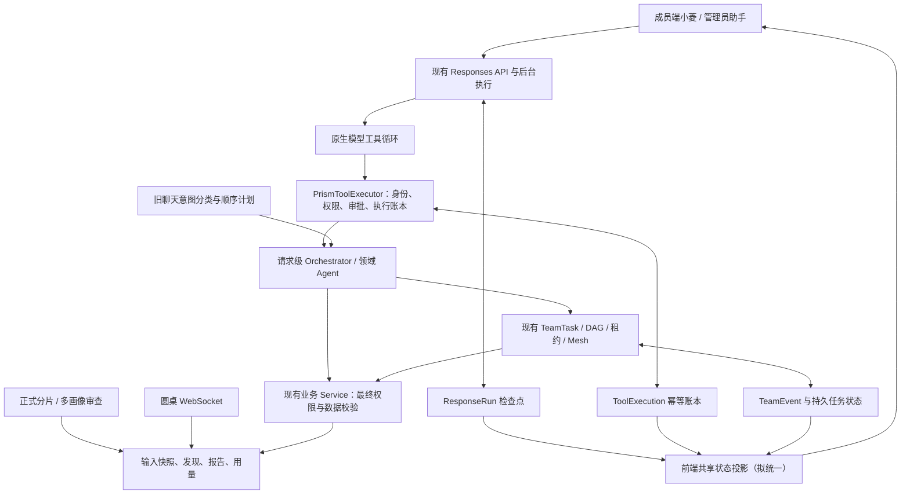

# 小菱与全栈优化：设计方案

## 一、判断与边界

Prism 已不是只有几个固定提示词的审查页面：它同时有真实 Responses 工具循环、旧聊天计划器、团队 DAG 调度、正式审查管线、圆桌讨论、原生沙箱/渗透报告、治理、审批、预算和发布能力。应加强不同路径的共同执行事实、恢复语义和用户反馈，而不是再造一套 Agent 平台。

本文件主要是分阶段工程方案；3.8.4生产修复另见《生产发布验收》。契约生成与成员仪表盘的有界修复已开始本地实施，实际状态以阶段验收为准；下文尚未实施的新字段、性能预算和策略不冒充已存在接口。没有批准新增一套第三方Agent框架。

## 本批有界实施契约

- 仪表盘沿用summary、risk-distribution、issue-type-statistics、score-trend、review-frequency五个接口，不增加替代API或演示回退。每个分区独立维护loading/success/error；空数组仅在成功响应后表达无记录。
- 请求发起时递增该分区代际号，响应仅在组件仍存活且代际相等时写入；切日期重载图表不改变累计摘要的统计口径。单区重试不重复读取其他区，摘要和图表互不等待才能显示。
- 核心读取进度由五项请求实际返回数量计算，失败也明确列为读取结束但失败；不把读取结束等价于业务通过。已有SecurityPostureCard保留自身独立反馈，不计入这五项核心统计。
- 导出入口沿用既有权限判断，只有五项当前请求均成功且摘要合法时允许导出；累计数与近7/30/90天图表口径分别标示，不称全部都是周报。
- 团队终态修复仅加强既有fail-fast、锁及领取代际：失败后的未启动分支需要有原因的终态；仍执行的兄弟任务不得标为已停止或成功。历史异常行仅提供只读诊断，是否受控修复需另有预览、审计及精确目标。
- 本批不新增模型、依赖、数据库迁移、后台轮询或运行时动效库。权限/并发/错误/延迟响应回归和独立审查是发布前条件。

## 二、现有架构与复用点

`agent_responses_service.py`、`deepseek_responses_runtime.py`、`agent_team_service.py`、`agent_team_dispatcher.py`、`agent_mesh_dispatcher.py` 是本次核心追踪对象。不同执行器不强行合并成一个调度循环；通过稳定任务、来源和事件契约衔接。自定义 Skill 的文字编排与真正执行的子任务必须明确区分。

## 三、优先修复的正确性

| 优先项 | 已有能力 | 尚需解决 | 最小落点 |
| --- | --- | --- | --- |
| 执行所有权 | 启动恢复、重试、检查点、取消保护 | 新进程启动清扫可能接管另一存活进程的任务；属于多实例条件风险 | 在现有 run 增执行代际、租约和心跳，写入按 owner/version CAS，不重写执行器 |
| 父子终态 | 失败依赖阻断、父状态归约、手动重试 | 父 failed 但独立子 queued 的路径已离线复现，子任务会退出可调度集合 | 默认保持既有失败即停止语义，在同事务为未启动子任务记录 blocked 与 parent_failed；历史先诊断，不直接改 completed |
| 未知副作用 | run/call 唯一账本、参数指纹、防重复审批 | 工具已产生副作用但回执失败时，只能安全停在未知 | 写工具增加受控只读核账，核对 resource_ref 与幂等键；未知不自动重做 |
| 停止确认 | 取消标记、沙箱 stop、部分清理 | “请求取消”不等于外部资源已停；timeout 到 retry 的清理交叉场景待测 | 为本 attempt 记录停止请求、停止确认和清理待办，旧资源未确认前不启动下一 attempt |
| 执行与验收 | 末端汇总/复核节点 | completed 代表执行结束，不自动代表用户需求验收通过 | 兼容现有 status，分列验收结论、逐条标准与证据引用；未知/未测不能标通过 |

源码定位、反证、成立条件与离线复现详见《架构审视》R01–R06。对生产两条未终态子任务，必须先做父子 JOIN 和事件时间线复核，不能仅凭聚合统计断言成因。

## 四、SOP 从文字顺序到可恢复执行

现有 `sequence_workflow` 主要编译步骤文字，`agent_delegate` 在所读分支生成职责说明；不能从名字推导另一个 Agent 已启动。保留原行为，将能力说明区分为提示词工作流和持久执行工作流。

拟议持久 SOP 复用 TeamTask/DAG 或 Responses 工具调用，不新增并行调度器。每个步骤明确：

- 输入：已有参数模型、来源项目、文件版本/哈希、上游产物引用。
- 执行：目标 Agent/工具的冻结版本、权限、审批、超时、取消与幂等策略。
- 输出：产物类型、结构版本、执行结果、验收结果、证据和可读失败原因。
- 恢复：已完成步骤不再执行；未知副作用先核账；等待人工审批不自动放行。
- 版本：运行开始后固定 SOP、内置职责摘要、自定义发布版本及嵌套依赖快照，不随最新发布漂移。

旧文字工作流不自动升级为会产生真实副作用的任务。是否允许某条失败分支之外的独立任务继续，应是明确策略；未选择前沿用原有失败即停止含义，但补足子任务的可解释终态。

## 五、小菱与多 Agent 的交互

小菱应提供一张可追踪的“任务单”，而不是只有最终聊天文本：目标、已确认范围、当前阶段、等待对象、活动成员、已完成/总量、产物、失败原因、下一步。

继续使用现有会话重建、工具账本和团队 `after_id` 增量事件。先统一成员端与管理端的状态投影，再评估关键事件的持久游标；不把所有 Token 增量写成数据库事件。

多 Agent 已真实并发。现阶段的调度优化是解除整波等待：保留线程池、父锁、独立 Session 和数据库领取 CAS，短任务结束后补充一个已满足依赖的任务，而不是等同波最长任务结束。没有测量前不承诺提速比例。

模型调用应关联根运行、团队子任务、轮次和 attempt；缺少 usage 保持未知。先补全可核对调用证据，再讨论 root 预算的 reserve/settle/release。用户主动交互的预算规则不能照搬自动任务日预算，也不能凭空设置金额或调整现有任务频率。

## 六、前端、动效与反馈规范

### 保留并整合已有实现

复用 `FluidProgress`、`PrismLoading`、`useCountUp`、`ResponseToolTimeline`、`AgentTeamTrace`、`ThinkingCity` 和现有 CSS 令牌。已有 WebGL/Canvas 降级与清理能力，不再叠加常驻视频、第二套 3D 背景或新动画依赖。

### 先分清数据状态，再做动画

成员工作台 `Dashboard.vue` 的初始零值和 `avg_score || 0` 仍有未知/失败/真实零混淆机会，需先补失败复现，再复用管理员总览已验证的状态处理思路。接口失败不能播放数字增长到 0，旧值必须带更新时间和过期标记。

统一操作反馈：

| 事实 | 用户应看到 | 禁止做法 |
| --- | --- | --- |
| 输入不合法 | 字段旁原因、焦点定位、提交被阻止 | 把请求失败统称“暂无数据” |
| 请求已受理 | 真实 task/run ID、正在排队或处理 | “已创建”显示成“已通过审查” |
| 等待用户/审批 | 等待谁、原因、对应行动 | 保持“正在执行”动画和虚假百分比 |
| 接口失败/断连 | 可读错误、最后确认状态、重连/只读恢复 | 重新创建同一任务或清空有效结果 |
| 取消 | 先显示请求停止，再显示服务端停止确认 | 关闭弹窗即宣称任务取消 |
| 完成 | 产物、验收结论和缺口分列 | 将 unknown、skipped 或空摘要标通过 |

### 动效选择与实现边界

指定图库已独立准备，不复制到 Prism。推荐优先选择流程轨道、逐项结果、工具时间线与证据定位/侧栏；指标和评分只在有真实新数据时强调。八个精确候选及来源见《前端动效审视》。

建议新反馈通常控制在 150–250ms，数值更新沿用已有计数组件，不超过原有 650ms；这些是预算建议，不是已测帧率结论。点击不等待动画结束；减少动态效果时即时显示状态；Canvas/ECharts 和偏好动态切换单独验证；离屏、后台、卸载停止无必要运动。

图库是视频动效，不是 Vue 运行时；其本地许可不等于产品商用授权。用户选择后再明确业务位置和用途，不将预览 MP4 冒充实时任务反馈，也不直接打包第三方 TSX/素材。

## 七、数据库与工程规范

1. 输入强约束与存量合法空文件分开：扫描内容必须有效非空；合法空 `__init__.py` 可存储但不能伪装成有效扫描范围。
2. 未知历史快照保持可空，不通过迁移生成看似完整的假版本、假评分或假用量。
3. 两种排序规则先形成差异清单和查询复现，再设计兼容迁移；不直接全库 ALTER，不把临时 UNION 的错误冒充应用故障。
4. 逻辑外键、删除/隔离、状态枚举、唯一约束、JSON 产物和时间口径逐域校验，约束新增前先验证存量，无依据不自动修数。
5. 未来 E2E 默认在隔离环境；真实生产测试必须带可追溯来源和回退材料。数据库中存在记录不证明它是业务数据，不能按名称模糊清库。
6. 职责契约与生成文档由唯一源导出，增加只读差异检查。契约数量不能当成真实模型实例数；历史设计和当前事实入口分层。

## 八、异常与发布策略

权限、审批、幂等、来源和数据完整性失败时拒绝继续；非关键统计/可视化失败允许降级，保留已完成结果和明确缺口。正确性、SOP、性能与动效分批发布，每批有自身回归、迁移、版本、备份和生产验证，不以一次上线笼统签收后续所有方案。
