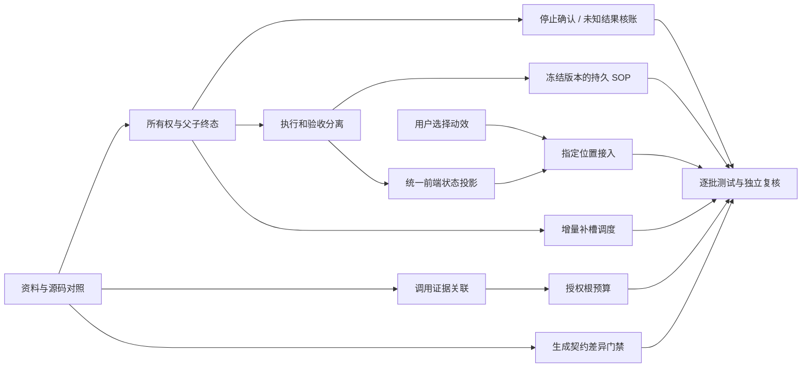

# 小菱与全栈优化：原子任务与依赖

## 任务契约

| 任务 | 输入与约束 | 输出与验收 | 依赖 | 当前状态 |
| --- | --- | --- | --- | --- |
| 已验收修复发布 | 原修复、回归证据、用户提交/部署授权；不混入新架构 | 精确 3.8.4、当次备份恢复、047、镜像/环境/API/登录页证据 | 无 | 已完成，真实业务矩阵仍阻塞 |
| 资料与源码对照 | 知识库 ready 收据、现有设计、当前源码；历史状态重验 | 真实调用图、已有能力、12 项发现、阅读与测试边界 | 无 | 已完成本阶段定向审视，非全库逐行精读 |
| 动效参考预览 | 指定 Git 库；先读技能和许可、不接入生产 | 可用本地图册、来源 SHA、8 个候选、浏览器展示 | 无 | 已完成，等待选择 |
| 契约生成规范 | 已复现 32/30 漂移、脚本硬编码旧数量；仅 stdlib 依赖 | 从真实契约导出，增加无写入检查，失败/通过测试和更新产物 | 资料对照 | 本地完成，17项回归和check通过，不混入3.8.4 |
| 父子状态诊断及有界修复 | 生产只读 task/team/event；不按聚合数改库；保持fail-fast | 测试先复现，未启动分支有解释终态，执行中分支和迟到结果不伪装停止 | 资料对照 | 本地修复完成，含复核节点缺失边界，107项关联回归及2820全量通过；历史数据未改、未部署 |
| 成员仪表盘事实反馈 | 现有五个API、权限和Vue组件；不制造演示业务 | 各区真实读取状态、可重试失败、区间响应防串、合法完整数据才导出、真实零和无评分区分 | 前端审视 | 本地45项页面回归及620全量通过，类型/lint/build通过；三项独立打回已修，未部署 |
| 执行所有权 | 原 store/recovery、版本字段、部署拓扑 | owner/lease/heartbeat 与写入 fencing；双进程及旧写拒绝 | 资料对照 | 后续独立实现 |
| 停止和未知结果 | 原执行账本、外部资源、幂等回执 | 核账与停止确认；崩溃/超时/重试交叉测试 | 执行所有权 | 后续独立实现 |
| 执行与验收分离 | 原团队状态、复核标准与证据 | 兼容状态字段、验收结论和标准明细；负例不能通过 | 父子状态诊断 | 后续独立实现 |
| SOP 冻结与持久化 | 原提示词工作流、发布快照、现有 DAG | 显式启用的持久 SOP；输入输出契约、固定依赖版本、恢复验证 | 所有权、验收语义 | 后续独立实现 |
| 调用关联与预算 | 现有 AiCallLog/预算、真实 usage | 根任务调用链可核账，unknown 不当零；额度策略另行授权 | 资料对照 | 后续独立实现 |
| 调度增量补槽 | 原线程池、CAS、配额与公平性 | A 长 B 短 C 依赖 B；C 在 A 前启动且无重复领取 | 执行所有权 | 后续性能优化，无提速承诺 |
| 前端统一事实反馈 | 管理/成员组件、账本和事件；不新增轮询 | 失败/空/未知/真实零，重连去重、两端一致、反馈可访问 | 验收语义、事件定义 | 后续独立实现 |
| 选定动效接入 | 用户调用码与用途确认，已有 Vue/CSS | 指定位置的真实事件驱动反馈、reduced-motion、窄屏和资源清理测试 | 用户选择、前端事实反馈 | 未开始 |
| 数据及交付独立复核 | Git blob、原始测试、当前生产聚合与目标来源 | 逐字节/逐项复算；通过、失败、阻塞明确区分 | 各对应产物 | 本地候选限定复验完成，6原探针全过且620/2820重计；真实登录及161全字段证明仍阻塞 |

## 依赖图

## 人工决策边界

尚未选择的动效不代选；审批/计费和独立分支继续策略不擅自改变。当前默认保留原业务语义，先修复有证据的闭环缺口。没有批准一次性架构替换，也不把本任务中列出的后续实现记为已经完成。
