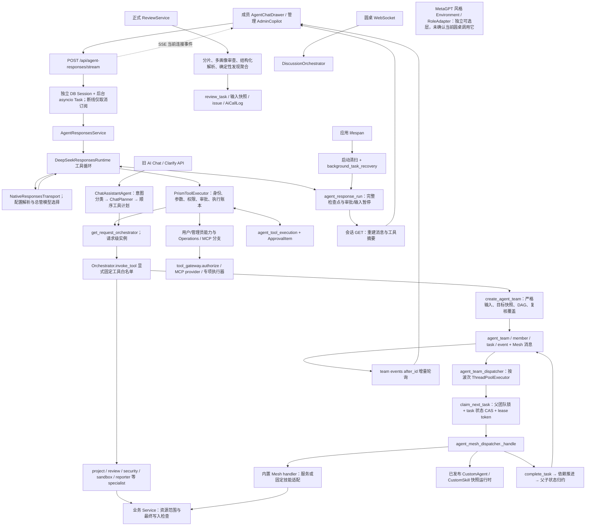

# Prism 小菱、Agent 调用链与 SOP 架构只读对照

## 1. 结论、版本与证据边界

**结论：不需要重写多 Agent 框架，也不应再添加同名能力。优先修复运行所有权、父子终态闭环、语义验收与可追溯性，再改调度效率。以下严格限定为 12 项。**

- 仓库：`/Users/li/Documents/代码程序/基于大模型智能体的代码审查平台`。
- 审阅开始 HEAD：`50673898bf89adb7d626647a067162fef5f7326c`，当时工作树包含主任务待提交修复。随后只读核对 HEAD 已为 `343616d9d40c1e44e17c7da465c7173c418debb5`，`VERSION=3.8.4`。用户告知功能提交为 `83e4e9eee94556bb4d98b0aac5321ca476bd6b60`。这些提交均不是本审阅创建的。
- 上述新 HEAD 的 Responses、团队服务和团队调度源码与所审工作树无差异。**本地版本不等于正在运行的生产版本。**用户最后确认旧修复已实际发布成功：**3.8.4 / 343616d9，047 head 与 ops-check 通过**。这是主任务提供的发布事实，本审阅未独立访问生产；此前“仍为 3.8.3、待发布”的通知已被此更新替代。
- 已读取用户提供的**发布前**本地生产统计文件 `/tmp/prism-release-20260906/pre-deploy-task-counts-and-disk.log:1`；它是间接生产证据，不是本审阅发起的生产查询；未取得发布后的父子状态重计数。
- **覆盖是定向、部分覆盖，不是“完整仓库和所有长文档已逐行精读”。**已完成关键入口、设计共识、核心状态转换与反证对照；长篇说明、AI/DB 文档、两份大设计和 generated 契约仍有未精读部分，详见 `/tmp/prism-optimization-20260906/source-coverage.json:1`。此前“全部相关长文档完整阅读”尚未达成；现按用户最新指令停止扩读并交付当前阶段，不以本报告代替全量架构验收。
- 本次仅新增两份 `/tmp` 交付物；不改源码、测试、仓库文档或知识库；无 commit、push、分支、生产访问或模型业务调用。没有读取 `.env`、专门的凭据文件或生产数据库。选定旧 Claude memory 意外夹有登录内容，已排除，不复制、不引用、不使用；报告不据此作任何认证操作。
- 进行了 **5 个原函数 AST 隔离复现 + 2 项确定性核对**，未导入应用配置、未连接数据库、未调用模型。没有执行 pytest、浏览器或沙箱实测，不能把已有测试文件写成“本次测试通过”。没有可调用的子代理工具，也未通过另启模型绕过禁令；数据复核使用独立确定性脚本，不冒称第二 Agent 审阅。
- `hard_gate=ready` 沿用收据 `20260905-190520-58f5a2786c`，未重跑 preflight。首页、治理、路由、项目 MOC、来源表和项目/Claude 线索已核对。历史事实只作索引，不当作当前运行事实。

优先级是**工程修复顺序**，不是漏洞等级；“条件性高风险”必须满足列明条件，不能直接升级为已发生的生产漏洞。

## 2. 真实调用图：不能把几种运行体系混成一个



重要连接证据：

| 连接 | 代码定位 | 结论 |
|---|---|---|
| UI → 实际 HTTP 入口 | `/Users/li/Documents/代码程序/基于大模型智能体的代码审查平台/frontend/src/utils/responsesStream.ts:9`、`/Users/li/Documents/代码程序/基于大模型智能体的代码审查平台/frontend/src/utils/responsesStream.ts:198`；`/Users/li/Documents/代码程序/基于大模型智能体的代码审查平台/backend/app/api/__init__.py:79` | 实际端点是 POST /api/agent-responses/stream。 |
| 前台 → 后台运行 | `/Users/li/Documents/代码程序/基于大模型智能体的代码审查平台/backend/app/api/v1/agent_responses.py:813`、`/Users/li/Documents/代码程序/基于大模型智能体的代码审查平台/backend/app/api/v1/agent_responses.py:861`、`/Users/li/Documents/代码程序/基于大模型智能体的代码审查平台/backend/app/api/v1/agent_responses.py:1057` | 有独立 Session、后台任务引用和断线解耦，不是仅靠浏览器维持的假后台。 |
| 模型 → 工具 → 后续模型轮次 | `/Users/li/Documents/代码程序/基于大模型智能体的代码审查平台/backend/app/services/deepseek_responses_runtime.py:698`、`/Users/li/Documents/代码程序/基于大模型智能体的代码审查平台/backend/app/services/deepseek_responses_runtime.py:938` | 有真实工具循环、最大轮数、上下文压缩、工具结果回灌、人工暂停；不是只有意图分类。 |
| 固定工具 → specialist | `/Users/li/Documents/代码程序/基于大模型智能体的代码审查平台/backend/app/services/agent_responses_service.py:1069`；`/Users/li/Documents/代码程序/基于大模型智能体的代码审查平台/backend/app/agents/orchestrator.py:958` | 显式白名单和参数模型，不是任意 getattr 即开放。 |
| 能力分支 → gateway | `/Users/li/Documents/代码程序/基于大模型智能体的代码审查平台/backend/app/services/agent_responses_service.py:2125`；`/Users/li/Documents/代码程序/基于大模型智能体的代码审查平台/backend/app/services/tool_gateway.py:226` | **不是所有固定工具都经同一个 gateway.execute**；入口 RBAC、能力 gateway、specialist/service 各有边界，不能仅因一层不判断就判越权。 |
| 团队 → 执行器 | `/Users/li/Documents/代码程序/基于大模型智能体的代码审查平台/backend/app/services/agent_team_dispatcher.py:70`、`/Users/li/Documents/代码程序/基于大模型智能体的代码审查平台/backend/app/services/agent_team_dispatcher.py:139`；`/Users/li/Documents/代码程序/基于大模型智能体的代码审查平台/backend/app/services/agent_mesh_dispatcher.py:903` | 内置可执行、受治理、session-only、needs_configuration 已区分。元数据“有这个 Agent”不代表有可执行 Handler。 |
| specialist → 审查服务 | `/Users/li/Documents/代码程序/基于大模型智能体的代码审查平台/backend/app/agents/review_orchestrator_agent.py:48` | 启动业务任务返回 task_id/status，与“整个审查成功”是不同层次。 |
| 旧路径 | `/Users/li/Documents/代码程序/基于大模型智能体的代码审查平台/backend/app/agents/chat_agent.py:138`；`/Users/li/Documents/代码程序/基于大模型智能体的代码审查平台/backend/app/agents/metagpt/environment.py:172` | 旧顺序 Planner 与内存消息环境仍存在，不应把它们的限制套给新的持久团队。 |

圆桌入口另见 `/Users/li/Documents/代码程序/基于大模型智能体的代码审查平台/backend/app/api/v1/ws_discussion.py:183`，它直接创建 DiscussionOrchestrator；MetaGPT 工厂的可选性见 `/Users/li/Documents/代码程序/基于大模型智能体的代码审查平台/backend/app/agents/metagpt/factory.py:9`，不把设计中的可选接入点画成已经发生的运行调用。

图中模型、生产、沙箱只表示源码调用方向，本审阅未触发这些链路。圆桌内部全生命周期、MCP 每个工具及全部 specialist 未穷尽验证。

## 3. 已存在的能力及必须保留的反证

1. **DAG 与真实并发已经存在。**有重复键、缺依赖、环检测；每个工作叶子必须到达 verifier/summarizer；有请求级 Session 与线程池。见团队服务 `/Users/li/Documents/代码程序/基于大模型智能体的代码审查平台/backend/app/services/agent_team_service.py:287`、`/Users/li/Documents/代码程序/基于大模型智能体的代码审查平台/backend/app/services/agent_team_service.py:317` 和调度器 `/Users/li/Documents/代码程序/基于大模型智能体的代码审查平台/backend/app/services/agent_team_dispatcher.py:168`。不能建议“先引入 DAG / 再加复核 Agent”。
2. **审批幂等、用户隔离已经存在。**检查点 claim 包含 user/surface/session/status/call_id；执行账本唯一 request_id、参数指纹比对、未知执行结果不自动重试；固定工具再次检查登录版本。见 Responses 服务 `/Users/li/Documents/代码程序/基于大模型智能体的代码审查平台/backend/app/services/agent_responses_service.py:518`、`/Users/li/Documents/代码程序/基于大模型智能体的代码审查平台/backend/app/services/agent_responses_service.py:807`、`/Users/li/Documents/代码程序/基于大模型智能体的代码审查平台/backend/app/services/agent_responses_service.py:1788`。
3. **取消、沙箱收尾不是空白。**团队取消清租约、记事件并清资源；沙箱等待循环刷新数据库、检查当前租约、取消时 stop；过期租约先停止旧沙箱再重新排队。见团队服务 `/Users/li/Documents/代码程序/基于大模型智能体的代码审查平台/backend/app/services/agent_team_service.py:734`、`/Users/li/Documents/代码程序/基于大模型智能体的代码审查平台/backend/app/services/agent_team_service.py:2208`、`/Users/li/Documents/代码程序/基于大模型智能体的代码审查平台/backend/app/services/agent_team_service.py:2384`，Mesh 调度 `/Users/li/Documents/代码程序/基于大模型智能体的代码审查平台/backend/app/services/agent_mesh_dispatcher.py:324`。
4. **已发布自定义 Agent 有版本冻结。**模板版本、release 和 checksum 已参与验证；不能笼统称“所有 SOP 都没有版本”。本报告 R08 只讨论仍未闭合的 builtin/嵌套委派/运行产物契约。
5. **已有成本保护和证据聚合。**自动任务按 Agent 的 UTC 日预算加锁；用户交互明确不使用该自动预算闸门。正式审查已使用确定性聚合和冲突人审，不应再加一轮自由模型投票替代证据。
6. **旧文档中的“模型失败仍可满分成功”不是当前代码事实。**当前 `/Users/li/Documents/代码程序/基于大模型智能体的代码审查平台/backend/app/services/review_service.py:973`、`/Users/li/Documents/代码程序/基于大模型智能体的代码审查平台/backend/app/services/review_service.py:1215`、`/Users/li/Documents/代码程序/基于大模型智能体的代码审查平台/backend/app/services/review_service.py:1244` 会抛 `ReviewCoverageError`，有失败时不走“空结果即无问题”。必须保留 3.8.4 修复，而不是重复提出已修问题。

### 文档、知识库与源码的对应关系

| 主题 | 文档或知识库依据 | 当前源码核对与处理 |
|---|---|---|
| 后台恢复与退出行为 | `/Users/li/Documents/代码程序/基于大模型智能体的代码审查平台/docs/小菱后台任务持久化与3.6侧边栏升级/CONSENSUS_小菱后台任务持久化与3.6侧边栏升级.md:5` | 已有断线解耦、检查点、等待人工不自动恢复；R01/R02/R11 补运行所有权、未知结果核账与事件一致性，不重造后台任务。 |
| 旧多画像审查的降级约定 | `/Users/li/Documents/代码程序/基于大模型智能体的代码审查平台/docs/多Agent优化/DESIGN_多Agent优化.md:42` | 旧文档允许失败后空结果成功；当前 review_service 的 ReviewCoverageError 已改变语义。保留 3.8.4 修复，R12 更新文档门禁。 |
| MetaGPT 作为可选适配层 | `/Users/li/Documents/代码程序/基于大模型智能体的代码审查平台/docs/权限隔离与圆桌修复与MetaGPT编排/CONSENSUS_权限隔离与圆桌修复与MetaGPT编排.md:134`；`/Users/li/Documents/代码程序/基于大模型智能体的代码审查平台/backend/app/agents/metagpt/factory.py:9` | 设计中的接入点不等于当前主调用链；实际 Responses 与持久 Team 分别追踪，不建议替换框架。 |
| 网关、版本与回滚愿景 | `/Users/li/Documents/代码程序/基于大模型智能体的代码审查平台/docs/agent-governance-platform/CONSENSUS_agent-governance-platform.md:94`；`/Users/li/Documents/代码程序/基于大模型智能体的代码审查平台/docs/agent-governance-platform/CONSENSUS_agent-governance-platform.md:168` | 当前为入口 RBAC、固定工具校验、能力 gateway、业务 service 多层控制；不能用历史“统一网关”愿景覆盖实际分支，也不从分层差异直接推断越权。 |
| 动态团队、独立复核、失败可见 | `/Users/li/Documents/Obsidian/myself/01_知识整理/项目/10-基于大模型智能体的代码审查平台.md:20`；`/Users/li/Documents/Obsidian/myself/01_知识整理/项目/10-基于大模型智能体的代码审查平台.md:37` | 项目卡明确只是旧摘要；R05/R06/R11 用本次源码证据核实闭环和验收语义，不把偏好当已实现事实。 |

## 4. 十二项最高价值发现与最小优化

证据等级：**L1**＝当前源码静态核对；**L2**＝原函数隔离复现或确定性结构核对；**L3**＝真实依赖集成/端到端验证（本次没有）。**P**＝用户提供的本地生产统计；**H**＝历史文档/知识库线索。发布成功属于用户最新确认，不等于本任务独立生产验收。等级不是漏洞严重度。

### R01｜P1／发布条件风险：启动恢复需要运行所有权，不能把新进程当成全局重启

- **证据等级**：L2；原函数 AST 隔离复现；多进程重叠是成立条件，未做生产或双进程集成验证。

- **已实现**：启动清扫、自动 retry、原生 waiting_approval/waiting_input 不自动执行；取消终态保护、并发 resume 的状态 CAS 已有。
- **确切证据**：`/Users/li/Documents/代码程序/基于大模型智能体的代码审查平台/backend/app/main.py:122`；`/Users/li/Documents/代码程序/基于大模型智能体的代码审查平台/backend/app/api/v1/agent_responses.py:230`、`/Users/li/Documents/代码程序/基于大模型智能体的代码审查平台/backend/app/api/v1/agent_responses.py:305`；`/Users/li/Documents/代码程序/基于大模型智能体的代码审查平台/backend/app/services/agent_responses_service.py:441`；`/Users/li/Documents/代码程序/基于大模型智能体的代码审查平台/backend/app/services/background_task_recovery.py:90`。
- **真实缺口**：默认 `max_age_seconds=0` 导致 force 回收全部执行态；未见 worker/进程代际所有权字段。`save` 的 version 会增加，但 UPDATE 不按期望 version/执行者 fencing，只特殊保护 cancelled。离线原函数证实：刚更新时间的 running 也会变 failed + recovery_requested。
- **影响/成立条件**：同库新旧进程重叠、增加 worker 或滚动启动时，可能错误接管活运行；模型轮次重复、旧检查点晚写是风险，**不能由此声称危险工具已重复执行**，其账本另有保护。生产是否采用这种拓扑未核验。
- **最小改造**：本次发布已由主任务确认成功，不要求重发或混入新改动；将“旧执行者确已停止”保留为下一次发布及横向扩容的核验条件；后续给 run 增 owner_epoch/lease_expiry/heartbeat，按过期 owner claim，save 用 owner/version CAS。复用现有 store 和恢复器；恢复线程改成有界池，避免积压运行每条起一个线程。
- **验收**：旧 worker 保持运行时启动第二实例不得改其状态；杀死 owner 后只恢复一次；旧 owner 晚到写入被拒；等待审批不自动执行；同时恢复 N 条时并发和预算有上限。
- **测试缺口/风险**：已有并发 retry/approve 测试不能代替双进程启动清扫测试。迁移需兼容旧 checkpoint；owner 租期过短会误接管，过长会增加恢复时间。

### R02｜P1：保留“未知结果不重做”，补可审计的人工核账恢复

- **证据等级**：L1；当前源码账本与审批路径对照；未测试真实外部副作用和人工核账。

- **已实现**：`run_id + call_id` 唯一账本、参数指纹、防重复审批、exact-call 续跑；不是缺少幂等。
- **确切证据**：`/Users/li/Documents/代码程序/基于大模型智能体的代码审查平台/backend/app/services/agent_responses_service.py:1788`、`/Users/li/Documents/代码程序/基于大模型智能体的代码审查平台/backend/app/services/agent_responses_service.py:1847`、`/Users/li/Documents/代码程序/基于大模型智能体的代码审查平台/backend/app/services/agent_responses_service.py:1905`、`/Users/li/Documents/代码程序/基于大模型智能体的代码审查平台/backend/app/services/agent_responses_service.py:1922`；`/Users/li/Documents/代码程序/基于大模型智能体的代码审查平台/backend/app/models/agent_response_run.py:31`。
- **真实缺口**：占位 executing 提交 → 业务/外部副作用 → 结果账本提交之间存在不可合并的故障窗口。遗留 executing 明确拒绝自动重试，但当前所读路径没有针对具体副作用的结果核账闭环；这是安全停机的可恢复性边界，不是“应该自动再执行一次”。
- **影响**：业务可能已发生，用户却看到未确认；重新换会话或新 call_id 不能被当作原执行的幂等恢复。
- **最小改造**：先给少数高价值写工具声明“可核账 resource_ref / idempotency_key / 只读状态查询”。增加 unknown→reconciled_success/reconciled_failed/manual_review 的受权限保护流程；不能核实的保持未知，不生成成功口吻。
- **验收**：分别在占位提交后、副作用后、账本完成前模拟进程退出；审批双击、参数被换、token_version 变化均不得重复执行；跨新 call_id 的恢复必须明确由人确认。
- **测试缺口/风险**：已有 mocked exact-call 测试保留，新增事务与外部副作用分离的故障注入。不同资源的核账逻辑不能靠通用字符串匹配；核账本身也必须授权、留证。

### R03｜P1：取消与超时需要“请求停止”和“资源已停止”两种事实

- **证据等级**：L1；当前取消、超时、重试清理路径对照；未实测沙箱资源及其全部 TTL 收尾。

- **已实现**：Responses 循环在模型轮次边界及工具完成后检查取消；团队清租约；沙箱有 stop、租约失效检查和清理失败日志。
- **确切证据**：`/Users/li/Documents/代码程序/基于大模型智能体的代码审查平台/backend/app/services/deepseek_responses_runtime.py:1012`；`/Users/li/Documents/代码程序/基于大模型智能体的代码审查平台/backend/app/services/agent_mesh_dispatcher.py:324`；`/Users/li/Documents/代码程序/基于大模型智能体的代码审查平台/backend/app/services/agent_team_service.py:734`、`/Users/li/Documents/代码程序/基于大模型智能体的代码审查平台/backend/app/services/agent_team_service.py:951`、`/Users/li/Documents/代码程序/基于大模型智能体的代码审查平台/backend/app/services/agent_team_service.py:2048`、`/Users/li/Documents/代码程序/基于大模型智能体的代码审查平台/backend/app/services/agent_team_service.py:2384`。
- **真实边界**：已开始的通用工具不能安全强停；沙箱 waiter 的本地 timeout 只返回失败，其失败重排队路径不像过期租约恢复那样先显式完成资源清理。`cleanup_terminal_team_resources` 只扫描 cancelled/expired，不覆盖 failed。**尚未穷尽 sandbox 自身调度和 TTL，不能断言必然遗留存活沙箱。**
- **影响**：界面取消并不总等于外部活动即时停止；超时后重排队是否仍占用旧资源，需要故障场景核验。
- **最小改造**：复用 runtime-resource ledger，显式记录 cancel_requested/stop_confirmed/cleanup_pending；所有会重试的沙箱 timeout/read_failed 先清理本 attempt 资源并确认终态，再准入下一 attempt。统一 root deadline 向下传递，不用强杀任意 Python 线程。
- **验收**：模型调用中取消、工具执行中取消、沙箱读失败、停止返回非终态、清理提交失败后重启；确认取消不触发剩余工具、旧资源未确认停止不得重试。
- **测试缺口/风险**：现有“取消停止沙箱”和“换租约停止旧沙箱”不是普通 timeout→retry 的证据；补这一交叉场景。错误清理不能碰成功部署或新 attempt 的资源。

### R04｜P2／仅优化：DAG 已并发，但波次屏障阻止空闲槽即时接续

- **证据等级**：L1；调度器波次结构与现有并发测试正文；未执行性能或吞吐测试。

- **已实现**：真实 ThreadPoolExecutor 并发、团队轮转、每团队 active 上限、独立 Session、数据库 CAS。
- **确切证据**：`/Users/li/Documents/代码程序/基于大模型智能体的代码审查平台/backend/app/services/agent_team_dispatcher.py:160`、`/Users/li/Documents/代码程序/基于大模型智能体的代码审查平台/backend/app/services/agent_team_dispatcher.py:168`、`/Users/li/Documents/代码程序/基于大模型智能体的代码审查平台/backend/app/services/agent_team_dispatcher.py:195`、`/Users/li/Documents/代码程序/基于大模型智能体的代码审查平台/backend/app/services/agent_team_dispatcher.py:205`；`/Users/li/Documents/代码程序/基于大模型智能体的代码审查平台/backend/tests/unit/services/test_agent_team_dispatcher.py:304`。
- **真实缺口**：先组成 wave，再消费整批 futures，整波结束后才再次领取。一个长任务拖住同波时，短任务完成释放的槽不能马上运行其已满足依赖的后继。现有 barrier 单测证明三任务并发，不证明“工作就绪即调度”。
- **影响**：不必要的关键路径等待；这不是串行调度，也没有足够证据量化生产提速百分比。
- **最小改造**：保留现有 ThreadPoolExecutor 和 claim；使用有界 in-flight 集合，每个 future 完成后刷新 Session、推进依赖、补充一个合资格任务。全局 worker 配额先与 R01 的多进程所有权设计协调。
- **验收**：A 长任务和 B 短任务并发，C 只依赖 B，C 必须在 A 完成前启动；验证跨团队公平、同团队上限、取消中不补单、无重复 claim；用 fake clock/barrier，不调用模型。
- **风险**：不能为提速移除父锁、CAS 或跨线程共用 Session；新增调度应通过公平性回归而不是仅测总耗时。

### R05｜P1／已有生产迹象：父团队终态必须闭合全部子任务，而不是让队列永远被排除

- **证据等级**：L2 + P；原函数隔离复现父 failed/子 queued；发布前本地统计有父全终态与 queued/waiting_dependency 各一条，未取得父子 JOIN 或发布后重计数。

- **已实现**：依赖失败递归 blocked，父团队失败归约，手动 retry 及 changed-strategy 约束。
- **确切证据**：`/Users/li/Documents/代码程序/基于大模型智能体的代码审查平台/backend/app/services/agent_team_service.py:1359`、`/Users/li/Documents/代码程序/基于大模型智能体的代码审查平台/backend/app/services/agent_team_service.py:1480`、`/Users/li/Documents/代码程序/基于大模型智能体的代码审查平台/backend/app/services/agent_team_service.py:1886`、`/Users/li/Documents/代码程序/基于大模型智能体的代码审查平台/backend/app/services/agent_team_service.py:2208`、`/Users/li/Documents/代码程序/基于大模型智能体的代码审查平台/backend/app/services/agent_team_service.py:2436`；`/Users/li/Documents/代码程序/基于大模型智能体的代码审查平台/backend/app/services/agent_team_dispatcher.py:20`；`/tmp/prism-release-20260906/pre-deploy-task-counts-and-disk.log:6`。
- **真实缺口**：`failed and not running` 即将父团队置 failed，即使不依赖失败分支的子任务还 queued。父团队随后不在候选集，claim 拒绝终态父团队；租约恢复只扫描 running，因此 queued/waiting_dependency 不会因重启自然消失。离线原函数已复现 parent=failed、independent child=queued。
- **生产证据边界**：独立复核团队 63 个，42 completed、15 failed、6 cancelled；子任务 197 条，其中 queued=1、waiting_dependency=1，其余为终态。**这与代码路径相符，但统计未给父子关联；也未排除缺父记录，不能声称已找到这两条的确定根因或具体父状态。**
- **影响**：父终态排除调度后，独立 queued 和等待依赖子任务可能长期失去后续事件；页面看见团队结束，但内部工作未获得明确处置。
- **最小改造**：先只读关联 task/team 和对应事件，列出不可调度子任务候选，不直接修数。随后锁定默认策略：保持 fail-fast 时，在同事务把剩余未启动子任务改为 skipped/blocked，并记录 parent_failed 原因；若需尽力完成独立工作，必须显式引入 continue_independent 策略，等独立任务终态后再聚合。恢复器增加“终态父 + 非终态子”的只读诊断/受控修复通道。
- **验收**：失败分支+独立分支+后继复核节点，分别覆盖 fail-fast 和允许降级；父完成/失败/取消/过期均不留无解释活动子任务；修复预览、重复修复幂等、不重新启动已完成或危险任务。
- **测试缺口/风险**：`/Users/li/Documents/代码程序/基于大模型智能体的代码审查平台/backend/tests/unit/services/test_agent_team_service.py:579` 验证的是一条依赖链，不覆盖独立排队分支。历史数据必须先逐条查证；不能直接把两条 queued/waiting 改 completed。

### R06｜P1：将“执行成功”与“需求验收通过”分开存储和展示

- **证据等级**：L2；原函数隔离验证聚合边界；负面 verdict 是构造输入，不证明真实 handler 当前可产生该组合。

- **已实现**：末端 verifier/summarizer 覆盖检查；sandbox verifier 等待 succeeded/失败终态；正式审查还有发现协议和冲突人审。
- **确切证据**：`/Users/li/Documents/代码程序/基于大模型智能体的代码审查平台/backend/app/services/agent_team_service.py:317`、`/Users/li/Documents/代码程序/基于大模型智能体的代码审查平台/backend/app/services/agent_team_service.py:1446`；`/Users/li/Documents/代码程序/基于大模型智能体的代码审查平台/backend/app/services/agent_mesh_dispatcher.py:145`、`/Users/li/Documents/代码程序/基于大模型智能体的代码审查平台/backend/app/services/agent_mesh_dispatcher.py:734`；`/Users/li/Documents/代码程序/基于大模型智能体的代码审查平台/backend/app/agents/review_orchestrator_agent.py:59`。
- **真实缺口**：聚合层按任务 completed 判团队 completed；reporter 收到非空 dependency_context 就返回 completed，表示整理完成，并不独立验证业务结论。离线输入 completed 但 verdict=failed 的复核结果，父团队仍 completed；这证明聚合边界，不证明现有真实 handler 一定产生该输入。
- **影响**：用户容易把“已汇总/已启动审查”理解为“审查通过/需求完成”；依赖成功状态还不足以证明产物达到验收标准。
- **最小改造**：保留现有 status 兼容字段，新增 execution_status、acceptance_verdict、criteria_results、evidence_refs；summarizer 仅汇总，不能填独立复核通过。异步任务启动返回的 task_id 应由明确 wait/inspect 节点等待业务终态；最终结果选择明确 final_task_key，不依赖最后一条 verifier 查询结果。
- **验收**：全部 worker completed 但关键验收失败；缺证据的空摘要；仍 running 的业务 task；只读历史核对与新测试；多复核节点顺序变化；结论不能将 unknown/skipped 写成 passed。
- **风险**：不要把“发现漏洞”混同“Agent 执行失败”；新结论字段必须与正式 review 的风险/评分语义并存，不篡改历史报告。

### R07｜P1：把声明式 sequence_workflow 的提示词语义与可恢复 SOP 执行明确区分

- **证据等级**：L2；原函数隔离复现声明式编译结果；未执行模型委派或持久 SOP 全链路。

- **已实现**：CustomSkill 版本、序列定义、依赖循环/深度约束；readonly_tool 可调用受控只读工具；团队 DAG 已是可复用执行基座。
- **确切证据**：`/Users/li/Documents/代码程序/基于大模型智能体的代码审查平台/backend/app/services/declarative_agent_runtime.py:283`、`/Users/li/Documents/代码程序/基于大模型智能体的代码审查平台/backend/app/services/declarative_agent_runtime.py:306`、`/Users/li/Documents/代码程序/基于大模型智能体的代码审查平台/backend/app/services/declarative_agent_runtime.py:331`、`/Users/li/Documents/代码程序/基于大模型智能体的代码审查平台/backend/app/services/declarative_agent_runtime.py:349`；`/Users/li/Documents/代码程序/基于大模型智能体的代码审查平台/backend/app/services/skill_service.py:61`；`/Users/li/Documents/代码程序/基于大模型智能体的代码审查平台/backend/app/models/agent_skill_record.py:39`。
- **真实缺口**：`agent_delegate` 在所读实现中生成职责文字，`sequence_workflow` 递归编译“步骤 N”字符串；它不是逐步骤的子模型派发、检查点、补偿或输入输出绑定。原函数隔离复现确认了这一点。不能因为名称叫 delegate 就宣称另一个 Agent 已真实执行。
- **影响**：提示词序列没有逐步持久执行保证；若界面或需求把它当作已经委派、已经可恢复，会高估完成证据。需要持久 SOP 的场景才启用新语义，不能将原有提示词功能本身定性为漏洞。
- **最小改造**：先在能力说明区分 prompt_workflow 与 durable_workflow；仅对明确需要恢复/审批的 SOP 增一个编译适配层，映射至现有 TeamTask/DAG 或 Responses 工具调用，不引入第二套调度器。每步绑定输入、产物引用和失败策略，不新增同职责 Agent。
- **验收**：前三步后断电，恢复只继续未完成步骤；委派必须有实际 child run/evidence；readonly_tool 失败不被“跳过”文案伪装成功；审批步骤不得在编译阶段执行。
- **风险**：改变旧 prompt_workflow 行为会扩大成本与副作用；必须显式 opt-in，不能把所有既有序列自动升级为真实执行。

### R08｜P1：已有模板冻结，但运行级 SOP、builtin 与嵌套委派还需可验证快照

- **证据等级**：L1；目标快照、输入 schema 与嵌套版本选择的源码证据；未做发布中恢复实测。

- **已实现**：自定义成员的 template_version_id、release_id、checksum；固定工具 Pydantic 参数模型；TeamTask 输入严格顶层约束；协作消息和职责契约。
- **确切证据**：`/Users/li/Documents/代码程序/基于大模型智能体的代码审查平台/backend/app/services/agent_team_service.py:208`、`/Users/li/Documents/代码程序/基于大模型智能体的代码审查平台/backend/app/services/agent_team_service.py:995`；`/Users/li/Documents/代码程序/基于大模型智能体的代码审查平台/backend/app/schemas/agent_team.py:38`；`/Users/li/Documents/代码程序/基于大模型智能体的代码审查平台/backend/app/services/declarative_agent_runtime.py:319`；`/Users/li/Documents/代码程序/基于大模型智能体的代码审查平台/backend/app/agents/contracts.py:37`。
- **真实缺口**：team task 的 input 仍为通用字典、result 为 JSON；AgentContract.output_fields 是描述而非所有产物通用的强校验。嵌套 custom delegate 取目标 current_published_version_id 编译文字，未展示目标版本随外层版本一起冻结。不能从外层“版本不可变”推导整条 SOP 的解析结果完全不可变。
- **影响**：重启或重放时嵌套目标漂移，可能让同一个外层版本编译出不同上下文；通用 JSON 也较难在步骤边界拦截不兼容产物。
- **最小改造**：沿现有 release snapshot 增 sop_id/version、source_release、builtin_contract_hash、嵌套依赖版本和校验和清单；每类步骤复用已有 Pydantic 输入/输出模型。产物保留类型、schema_version、source_revision/hash、范围与证据来源，不复制完整源码进知识库。
- **验收**：运行中发布新模板/目标版本，旧任务恢复仍使用原快照；类型错、缺产物、未知字段、证据属于另一项目/版本均受控失败；历史任务缺字段继续可读但明确 legacy。
- **风险**：迁移和产物校验不可破坏原生 finding 格式，也不能把提示词中的“字段要求”误判为已有强类型执行契约。

### R09｜P2／仅建议：在自动日预算之外增加用户可见的根任务总预算

- **证据等级**：L1 / 仅建议；核实自动预算与交互预算边界后提出新根预算策略；不认定现有预算故障。

- **已实现**：自动任务按 Agent UTC 日累计用量、进程锁+数据库行锁、锁失败关闭；最大模型轮数、上下文预算、模型分层和回退。
- **确切证据**：`/Users/li/Documents/代码程序/基于大模型智能体的代码审查平台/backend/app/services/agent_cost_budget_service.py:126`、`/Users/li/Documents/代码程序/基于大模型智能体的代码审查平台/backend/app/services/agent_cost_budget_service.py:174`；`/Users/li/Documents/代码程序/基于大模型智能体的代码审查平台/backend/app/services/agent_responses_service.py:2500`；`/Users/li/Documents/代码程序/基于大模型智能体的代码审查平台/backend/app/services/deepseek_responses_runtime.py:715`。
- **真实边界**：源码明确 interactive 不走自动日预算闸门；现有判断是已持久化用量达到上限才拒绝下一次，并非为本次最大输出预留。没有从这些入口看到 root run→团队→重试统一资金/Token 预留账本。**这不是说现有自动预算未实现，也不推断存在异常账单。**
- **影响**：多轮、并发子任务与重试可以分别符合现有局部上限，却没有统一呈现用户一次根任务愿意承担的总预算；这是新增产品策略建议，不是对现有自动预算失效的结论。
- **最小改造**：只增加显式用户授权的 root budget，覆盖总管、child、retry、fallback；复用现有预算服务实现 reserve/settle/release。实际 usage 缺失标 unknown，展示预计剩余、已用、授权扩额；默认不凭空改变现有自动任务频率或 UTC 日口径。
- **验收**：并发子任务抢同一剩余额度；最后一次输出超过剩余；中途取消释放未用预算；usage 缺失；fallback 与重试都计入同一 root；不足时暂停请求加额而非误称故障。
- **风险**：预估 Token 不是实际账单；跨 worker 要数据库级原子预留，不能另加一个仅进程内计数器。

### R10｜P1：AI 调用证据需要关联到 run/team/task/attempt，失败和未知用量也要可追踪

- **证据等级**：L1；模型回调时序、日志字段与标签聚合的源码对照；未做计费、传输或数据库故障注入。

- **已实现**：AiCallLog 用户、Agent、模型与 Token 字段；Responses 每轮回调落日志；工具执行账本和团队 trace/message 关联；正式审查有独立来源主张聚合。
- **确切证据**：`/Users/li/Documents/代码程序/基于大模型智能体的代码审查平台/backend/app/services/agent_responses_service.py:2530`；`/Users/li/Documents/代码程序/基于大模型智能体的代码审查平台/backend/app/services/deepseek_responses_runtime.py:775`；`/Users/li/Documents/代码程序/基于大模型智能体的代码审查平台/backend/app/models/ai_call_log.py:17`；`/Users/li/Documents/代码程序/基于大模型智能体的代码审查平台/backend/app/agents/skills/orchestrator_skill.py:52`。
- **真实缺口**：Responses 日志构造未写 run_id/team_task/round/attempt，模型表也无对应关联列；仅拿到 response 后才调用 on_round，日志回调异常被吞掉，因此传输失败和账本失败不都能在这一记录链中完整呈现。另有 orchestrator Skill 聚合标签仍为 orchestrator，而 Responses 写 chat_assistant/manager，不能默认三者指标等价。
- **影响**：根任务成本与失败原因难以逐调用核对，可能把未记录的失败或未知用量解释成未发生；当前仍有其他日志来源，不能据此断言系统全部日志丢失。
- **最小改造**：复用 AiCallLog 增可空关联和 request/attempt/usage_status；模型请求开始、结束、异常分别有稳定调用标识；日志写失败进入轻量待补写/可观测告警，不用模型生成日志。明确定义总管与人格标签映射，不把用户全文提示词当必须日志内容。
- **验收**：传输异常无 response、半流失败、usage 缺失、数据库暂时失败、重试和模型 fallback；一个 root 的调用明细可加总追溯，unknown 不当 0；两个用户互不可见。
- **风险**：Token 累计要防重复记账；不能仅凭日志字段缺失断言提供商未计费或实际费用为零。

### R11｜P2：进度订阅已可恢复，下一步统一稳定事件游标而不是再加一种动画

- **证据等级**：L1；SSE、会话重建与团队增量轮询源码；未做浏览器刷新、慢连接或乱序实测。

- **已实现**：断开 SSE 不取消后台任务；会话 GET 根据检查点和工具账本重建状态；团队 after_id 分页、has_more 排空、single-flight、失败退避和终态停止；已有卡片/思考城市/成员追问入口。
- **确切证据**：`/Users/li/Documents/代码程序/基于大模型智能体的代码审查平台/backend/app/api/v1/agent_responses.py:824`、`/Users/li/Documents/代码程序/基于大模型智能体的代码审查平台/backend/app/api/v1/agent_responses.py:1029`、`/Users/li/Documents/代码程序/基于大模型智能体的代码审查平台/backend/app/api/v1/agent_responses.py:1128`；`/Users/li/Documents/代码程序/基于大模型智能体的代码审查平台/frontend/src/composables/useAgentTeamEvents.ts:77`、`/Users/li/Documents/代码程序/基于大模型智能体的代码审查平台/frontend/src/composables/useAgentTeamEvents.ts:84`；`/Users/li/Documents/代码程序/基于大模型智能体的代码审查平台/frontend/src/components/ai/AgentChatDrawer.vue:1275`。
- **真实边界**：Responses sequence_number 在当前连接内自增，没有与团队 after_id 共用的持久游标；队列满时反复等待 queue.put，属于背压；断线后的恢复主要是状态重建，不等于逐个中间事件重放。前端主题是否完整跨刷新保持需浏览器验证，不能只凭动画代码判断。
- **影响**：断线恢复后的当前事实可以恢复，但逐事件顺序与缺口不易证明；不同页面独立投影更难保证状态、审批和团队卡片一致。
- **最小改造**：沿既有账本为关键状态事件提供 run/event_id/parent/task/attempt/phase/timestamp；可重放关键事件、合并高频 delta。保持一个共享前端投影层供两端使用，界面展示正在执行、等待谁、已完成/总量、真实失败和停止确认，不伪造百分比。
- **验收**：断线后重复/乱序/跨页事件；后台已完成但客户端最后看到运行中；慢订阅者、切换账号/会话、取消与终态同时到达；两端显示一致且不重复发起模型任务。
- **风险**：持久化所有 token delta 会膨胀数据库；只将必要事件持久化并定保留期，授权过滤必须同时覆盖历史回放。

### R12｜P1：文档/生成契约与测试门禁应绑定同一 release，禁止历史设计覆盖现有事实

- **证据等级**：L2 + H；仅 stdlib 契约模块与 generated JSON 的确定性集合比较；历史文档/知识库用于漂移对照，未执行全量测试。

- **已实现**：职责唯一源、导出脚本、大量契约/权限/恢复/并发单测；已有项目文档体系和知识库来源登记。
- **确切证据**：`/Users/li/Documents/代码程序/基于大模型智能体的代码审查平台/docs/generated/agent-contracts.md:3`；`/Users/li/Documents/代码程序/基于大模型智能体的代码审查平台/backend/app/agents/contracts.py:98`；`/Users/li/Documents/代码程序/基于大模型智能体的代码审查平台/docs/多Agent优化/DESIGN_多Agent优化.md:40`；`/Users/li/Documents/代码程序/基于大模型智能体的代码审查平台/docs/03-系统设计文档.md:628`；`/Users/li/Documents/代码程序/基于大模型智能体的代码审查平台/backend/tests/unit/services/test_deepseek_responses_runtime.py:932`。
- **已核实漂移**：只执行 stdlib 依赖的 contracts 模块并核对 generated JSON：当前静态职责契约 **32**，generated **30**，缺 operations、sandbox_deployer。这是生成资料过期，不是运行时缺这两个 Agent，也不是实际 LLM 实例数量。旧文档仍保留同步流程、固定 Agent 数、失败后可成功和“未来异步化”等历史描述。
- **知识库对照**：旧 Claude memory 曾写 main 缺 agent_teams API，当前本地文件和 dispatcher 已存在；只能标为历史快照。不得照旧笔记再造 API，也不应删除历史证据。本次只在报告指出，不改主库。
- **影响**：新参与者可能按历史文档再造已有能力，或把文档数量/旧通过数当作当前执行能力和发布证据。
- **最小改造**：复用既有导出脚本增加无写入的 check/diff 模式，release 构建门禁校验生成契约；文档用“当前事实入口+历史决策”分层。补以下故障矩阵并绑定 release、输入哈希、执行范围、mock/实机标识：双进程恢复；父终态子非终态；负面验收；未知副作用核账；跨 attempt 清理；事件回放；根预算并发。
- **验收**：导出结果与源码集合/关键属性一致；虚假 Handler 不计为 executable；每个矩阵格明确通过/失败/未测/阻塞；付费长链路没运行就写未验证，不沿用历史通过数。
- **风险**：不要用一次生成资料刷新当作全量运行验收；也不要为追求覆盖率导入真实配置、模型或生产资源。用户提供的 1271 仅涉及临时 UNION 和排序规则漂移，不纳入本报告的应用缺陷计数。

## 5. 分阶段执行方案（本次均不实施）

| 阶段 | 范围与顺序 | 验收门禁 | 本次发布关系 |
|---|---|---|---|
| S0：已发布后的事实固定 | R01 的停旧/起新条件；R05 的 2 条非终态子任务逐条只读关联；保留 3.8.4 已验收修复 | 记录执行者拓扑、版本/镜像事实、父子事件；不自动改数、不新触发模型 | 已发布成功；这里只做独立核账，不要求重发或把架构改造混入当前 release |
| S1：正确性与恢复闭环 | R01 运行 owner/CAS → R05 父子终态 → R02 未知副作用核账 → R03 清理闭环 | 故障注入、幂等、权限负向和状态不变量测试；迁移/回滚审阅 | 后续独立变更批次 |
| S2：SOP 与验收契约 | R06 语义验收 → R08 版本/输入输出快照 → R07 编译至既有 DAG | 运行恢复保持旧版本；真实委派证据；unknown 不当通过 | 旧流程默认不变、显式启用 |
| S3：成本、效率与用户进度 | R10 关联日志 → R09 root 预算；R04 增量补槽；R11 事件投影 | 可加总证据、并发额度、关键路径测试、断线回放 | 没有观测基线前不宣称提速/省费比例 |
| 全程门禁 | R12 文档契约与故障矩阵 | 同一个 release 的源码、契约、测试与证据一致 | 不重复生成 Agent，不换框架 |

依赖关系：R01 支撑 R04 的多 worker 配额；R10 支撑 R09 的可信结算；R08 支撑 R07 的可恢复执行；R06 为 R07/R11 的“完成”定义提供统一语义。

需要后续审批的业务选择仅有：独立失败分支继续还是 fail-fast；何种结果算需求验收通过；用户主动任务是否授权 root 预算及额度。不在本次只读任务中默认为用户已批准实现。

## 6. 本次验证与数据重新计数

| 编号 | 方法 | 结果 | 不能推导的结论 |
|---|---|---|---|
| offline-01 | AST 提取原 `_recover_stale_active_run`，内存替身，不导入应用 | fresh running + force=True → failed/recovery_requested | 未证明生产有并行 worker |
| offline-02 | 同一原函数，waiting_approval 对照 | 保持 waiting_approval | 未覆盖所有审批崩溃窗口 |
| offline-03 | AST 提取原 `_refresh_team_status` | completed 任务携带负面 verdict，父仍 completed | 不证明当前真实 handler 必然会输出此负面结构 |
| offline-04 | 同一原函数，failed 与独立 queued 分支 | 父 failed、独立子仍 queued | 聚合生产日志不能确定两条历史记录的原始成因 |
| offline-05 | AST 提取 `_compile_skill_version` | agent_delegate/sequence_workflow 产出说明文字 | readonly_tool 不是纯文字，不能一并称为未执行 |
| contract-check | 检查 imports 后仅运行 stdlib contracts，并与 JSON 比较 | 32 vs 30，generated 缺两个代码标识 | 不等于 32 个真实模型 Agent |
| evidence-recount | 独立 Python 重新解析用户提供的 TSV 统计 | review_task=146、team=63、team_task=197、job_run=54,742；非终态子=2 | job failed=7,748 是累计，不代表当前仍故障 |

生产摘要逐项：团队 completed=42、failed=15、cancelled=6；子任务 completed=145、blocked=16、cancelled=14、dead_letter=11、failed=9、queued=1、waiting_dependency=1；job success=46,994、failed=7,748。不计算“当前故障率”，不从磁盘历史可回收空间推断 OOM。

只读关联建议，**仅作为交给发布任务的查询草案，本审阅未执行**：

```sql
SELECT child.id, child.team_id, child.task_key,
       child.status AS child_status, parent.status AS parent_status
FROM agent_team_task AS child
LEFT JOIN agent_team AS parent ON parent.id = child.team_id
WHERE child.status IN ('queued', 'waiting_dependency', 'running')
  AND (parent.id IS NULL OR parent.status IN ('completed', 'failed', 'cancelled', 'expired'))
ORDER BY child.team_id, child.id;
```

关联查询后还需读取对应 task/team event 的时间线，再决定是否需要受控数据修复；不要仅根据两条计数自动执行 UPDATE/重试。

## 7. 覆盖、未验证项与只读收尾

- `source-coverage.json` 保存实际请求阅读的文件/行段、阅读深度、截断提示、内容哈希、未读候选，以及本次引用和复现边界。检索命中、结构解析、全文精读分开统计。长响应被截断的文件不冒称完整理解。
- 尚未全量逐行阅读的强制文档包括：说明文档全文、DB/AI 长文档剩余章节、generated 契约全部提示词、MetaGPT/AgentSkill 大设计及部分共识末尾、治理平台长设计。它们列入未完成阅读清单；本报告不声称满足这一全量子要求。
- 没有执行 MySQL 多进程锁竞争、服务重启、网络中断、浏览器点击、真实模型、生产部署或沙箱停止验证。现有测试采用替身的地方也不能支持生产已验收结论。
- 没有检查 `.env`、SSH、密钥、备份/数据库内容；用户提供的临时生产统计是唯一新增运行数据来源。其 collation 差异只记为规范漂移，未证明应用查询发生 1271。
- 既有 `knowledge_harness.py validate` 和 `postflight` 会写主知识库审计文件（脚本分别在 `/Users/li/Documents/Codex/2026-08-21/ban/scripts/knowledge_harness.py:374`、`/Users/li/Documents/Codex/2026-08-21/ban/scripts/knowledge_harness.py:897` 写文件）；与本轮“仅两份 /tmp 交付物可写”的最新边界冲突，因此未运行，也未回填/record-correction，不谎报收尾已通过。后续若主任务获得主库审计追加授权，可由主任务独立完成。
- 并发方案另对照了 Python 3.11 官方 concurrent.futures、SQLAlchemy Session FAQ、MySQL 8.0 locking reads 的原始文档。它们仅用于确认 Future 等待与 Session/事务锁语义；仓库行为结论仍由本地源码和离线复现支撑，未向外发送源码、知识库或凭据。

**到此停止扩展审计。两份交付物供主任务安排后续优化；不对本次生产发布作越界修改或全量安全背书。**
