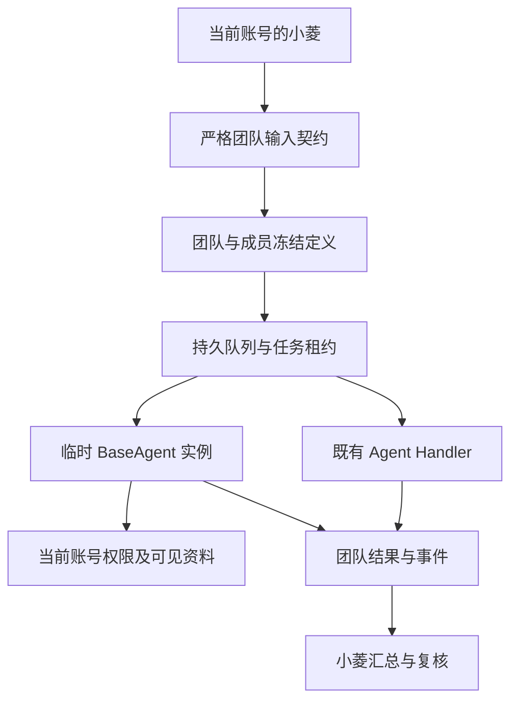

# 小菱临时团队与账号隔离：设计

## 契约与复用
成员地址支持 agent:、custom:、temporary:。临时地址后缀必须等于 member_key，definition 包含 purpose 和 instructions；非临时成员不得附加 definition。服务端保存定义和 SHA-256，不信任消息携带的临时定义。仅团队调度器可路由临时地址；校验 owner/team/task/member/lease、账号状态和当前入口权限后读取数据库快照执行。
临时分析复用 BaseAgent、当前模型配置、用量上下文、已有受权限保护的数据读取方法。任务与事件是持久化执行凭据，不新造永久模板或普通聊天会话。失败返回结构化错误，现有队列保留部分结果与有限重试。

## 隔离
所有私人查询都绑定 user_id。前端以账号、入口和会话确定存储/请求归属，换号销毁旧运行并丢弃迟到结果。图片使用私有且不可缓存响应。管理员同样必须匹配私人记录 owner。

## 依据
- [OWASP 授权检查](https://cheatsheetseries.owasp.org/cheatsheets/Authorization_Cheat_Sheet.html)：默认拒绝，并在每次请求检查权限。
- [OWASP 会话管理](https://cheatsheetseries.owasp.org/cheatsheets/Session_Management_Cheat_Sheet.html)：会话切换与终止需处理客户端状态边界。
