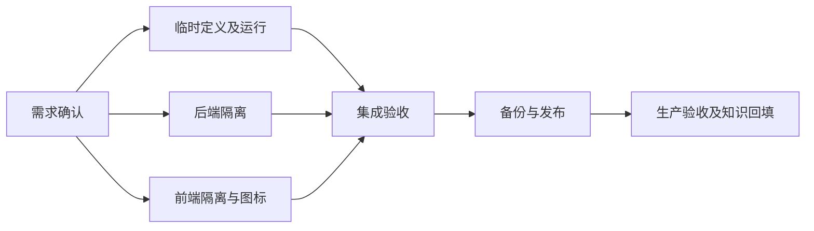

# 小菱临时团队与账号隔离：任务拆分

| 任务 | 输入 | 交付与验收 | 负责人 |
| --- | --- | --- | --- |
| 临时定义及调度 | 现有团队状态机 | 严格契约、冻结定义、有效租约执行、红绿回归 | 主控 |
| 临时模型运行 | 定义、当前账号、任务资料 | 独立实例、真实模型/使用量、结构化结果 | 独立审查代理 |
| 后端私人隔离 | 已复现的越权路径 | SSE、追问、圆桌、附件权限及测试 | 后端代理 |
| 前端换号与图标 | 用户已确认形象 | 迟到响应保护、隔离存储、可爱菱形精灵 | 前端代理 |
| 集成发布与知识闭环 | 全部修改及证据 | 回归、备份、发布、生产实测、独立核验 | 主控与独立代理 |

限制：不修改生产账号密码，不临时扩大用户权限，不将原始生产聊天或私有证据发布到公开仓库。
