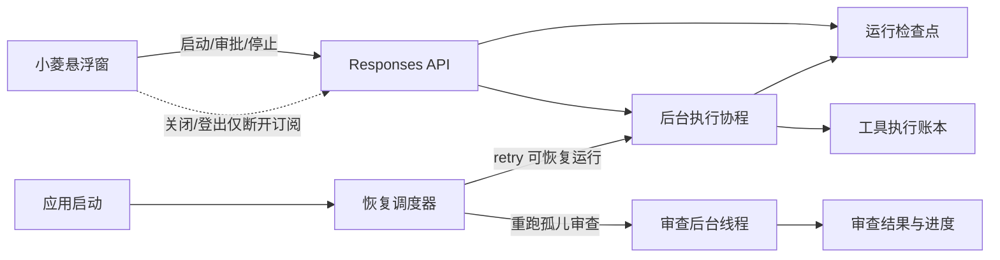

# 设计：小菱后台任务持久化与 3.6 侧边栏升级

## 后台执行架构

## 恢复策略

- Responses：启动清扫将陈旧执行态置为可重试失败态并记录恢复标记；恢复调度器使用独立数据库会话调用既有 `resume(action=retry)`。
- 常规审查：启动阶段把孤儿 `running` 任务标记为恢复中，删除该任务未完成的 `ReviewIssue`，重置计数后调用既有 `_run_review_task`。文件选择与规则快照关系沿用原数据。
- 恢复调度器不处理 waiting/cancelled/success 状态。
- 每个后台入口自行创建和关闭数据库会话，生命周期不依赖 HTTP 请求。

## 前端结构

- 侧边栏菜单数据保持原定义，新增显示分组层：工作区、智能审查、Agent 与安全、社区与支持、个人空间、系统管理。
- 分组折叠状态和整体收起状态存入 `localStorage`。
- 收起后只显示图标并以 tooltip 补充名称；移动端禁用窄栏形态，继续使用完整抽屉。
- 版本展示读取构建期环境变量，不再写死模板字符串。

## 异常处理

- 自动恢复单个任务失败不阻断应用启动，并将失败原因持久化。
- 版本文件缺失或格式非法时发布脚本直接失败。
- 用户显式停止走原取消接口，不与订阅断开混用。
