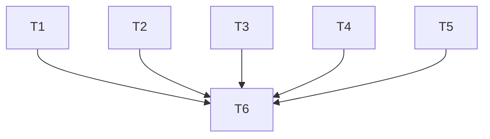

# 任务：小菱后台任务持久化与 3.6 侧边栏升级

## 原子任务

| 编号 | 输入 | 输出 | 验收 |
|---|---|---|---|
| T1 | 现有 Responses 检查点与启动清扫 | 自动恢复调度器 | 重启后自动 retry，等待态不动 |
| T2 | 现有 ReviewTask 后台线程 | 孤儿审查重跑 | 部分问题清理、计数重置、单次派发 |
| T3 | AgentChatDrawer 生命周期 | 订阅与取消语义拆分 | 卸载不取消，停止按钮仍取消 |
| T4 | 现有菜单与 RBAC | 悬浮岛、分组折叠侧边栏 | 所有原路由与权限保持 |
| T5 | Git SHA 发布链 | VERSION 单一来源 | 健康接口和前端同时显示版本 |
| T6 | T1-T5 | 自动测试与公网部署 | 测试通过，公网真实验证 |

