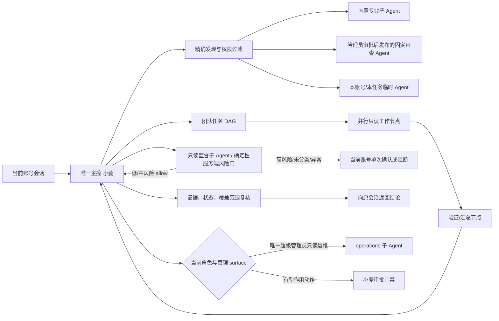
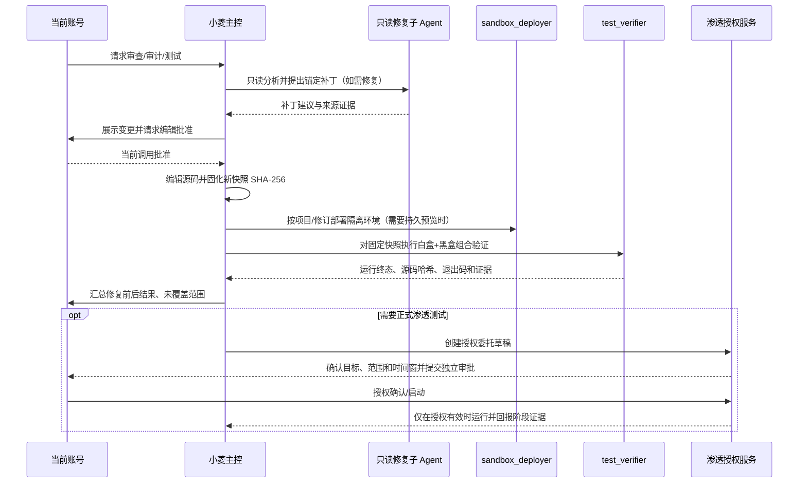

# 小菱唯一主控与 Agent 团队架构设计

## 分层

1. **身份和会话层**：`chat_assistant` 是两个 surface 共有的根身份；用户/管理员身份、会话 ID、权限集不合并。`manager` 只兼容历史权限编码，`orchestrator` 只作内部调度实现。
2. **发现和路由层**：由小菱调用当前账号的 `list_agents` 发现精确候选；仅当已发布 Agent 职责可确定且候选唯一时选择，否则询问。项目正式审查、安全审计、代码片段审查、管理端只读运维各走不同合同。
3. **执行层**：固定 Agent 从精确的已审批 release/version 加载；临时定义快照、校验和、租约和账号都必须匹配当前团队；团队调度器对每个节点并行领取有界任务。
4. **治理层**：创建由审查员完成；静态结构检查不作为真实模型测试；管理员独立审批；发布快照校验 checksum。`operations` 只读，写操作由小菱的既有风险分类/用户确认/审批流程完成。
5. **结果层**：每个子 Agent 返回任务状态、证据、错误和未覆盖范围；小菱等待真实终态，逐项检查任务叶节点和汇总引用，失败保留为失败或部分完成。
6. **监督层**：现有 `agent:supervisor` 是只读子 Agent；强制执行由 Responses 工具入口、Agent Team 创建/派发和政策执行器调用同一确定性服务端分类器完成，不把风险选择交给模型。固定低/中能力按服务端白名单自动放行；高风险要当前用户对单次调用确认；未知 MCP/动作、显式高风险策略、监督异常或监督审计落库失败不自动执行。监督审计只保存运行/调用标识、工具、风险级别、分类和理由，不复制对话正文或秘密；运行恢复按当前账号与 run 重放徽标。结果检查只验证结构和证据字段形状，语义真实性需独立 verifier 与源证据复核，不能承诺消除幻觉。

## 账号与 surface 信任边界

- 身份来自登录依赖，`user_id`、surface 和 session 由服务端工具上下文注入，模型参数不能改写。
- 任务派发须为受信任的小菱执行，且来源会话必须属于同账号、处于 active 状态；领取前重新核验。
- `operations`/`monitor` 的授权由服务端以当前角色、surface、唯一超级管理员账号和集中 RBAC 联合判断；目录隐藏不是授权控制。
- 临时 Agent 没有可注入权限字段和可变模型端点；只接受 purpose/instructions，工具行为由受控团队运行时提供。

## 证据与模型结果控制

- 固定审查 Agent 的服务端逐项要求正整数 `line_number`，核对完整 `evidence` 是否逐字存在于当前源码分片，并要求引文实际起始行等于报告行；不匹配则整片失败，不把部分结果声明完整。
- 临时 Agent 的发现携带逐字 `evidence_quote`；源码引文必须存在于所报原文行。超长来源压缩时，每片的 `evidence_quotes` 先逐字对照该片原文，行范围统一处理 LF、CRLF 和 CR，最终发现只能引用经核验的引文；来源或引文校验失败则不生成完成态。
- 跨文件、跨分片或依赖路径不完整时区分推断和未覆盖内容。
- Agent 输出 schema、issue parser、逐字证据与行号校验、来源锚点和证据质量/置信上限约束结果；模型截断、无效条目或覆盖无法证明时失败闭合。
- 运行进度来自 Responses/团队持久事件，不能从 Agent 自述推断；摘要必须关联真实任务/报告 ID 和运行状态。
- 这些措施可拒绝虚构引句或错位行号，并降低其他幻觉风险；真实引文仍可能被模型错误解释，不能保证语言模型从不出错。C13 严格 xfail 已证明带来源标记的摘要仍可能遗漏语义；因此保持人工审批、可追踪原文和人工复核。

## 异常策略

- 工具超时或失败：节点状态明确标失败/可重试，按有限预算和改变策略重试；并保留已完成节点结果。
- 会话归档、用户撤权、Agent 停用、快照校验失败：领取或执行时阻断，不将旧快照视为继续授权。
- 上下文超预算：保留顺序、来源 ID 和核验引用做分层压缩；若覆盖完整性校验失败，停止并报告上下文不完整，不静默截断。
- 生产发布失败：检查审批状态和既有 release，不在缺证据时手工宣称生效；发布版本保留回滚目标。

## 白盒、黑盒、修复与渗透任务链

- `test_verifier` 默认执行 `run_project_tests(test_mode="combined")`；团队输入应传入固定 `project_id` 和源码版本标识。sandbox 服务保存不可变源码归档及 SHA-256；如果采用部署依赖，服务端检查项目和修订号一致并完成资源交接后再创建测试环境。
- 远程 HTTP 黑盒探测与本地沙箱黑盒分开：外部目标必须使用 HTTPS、公网目标固定解析并在当前小菱调用中逐目标批准；批准记录与工具名、用户、运行、调用 ID、完整参数绑定。团队成员不能自签授权。
- 源码写入仍由小菱作为当前用户发起并经既有审批，不给只读审查/修复子 Agent 写工具；编辑后按新内容重新固化快照，复测证据必须对应新哈希。正式渗透只由独立授权委托触发，不能由 `test_verifier` 或黑盒 smoke 代替。
- 本轮自动化只证明 runner 状态传播、授权门和团队路由契约；未证明真实模型会按提示完成每一步，也未执行生产 worker、外部目标或真实渗透委托。
