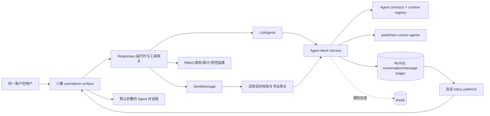
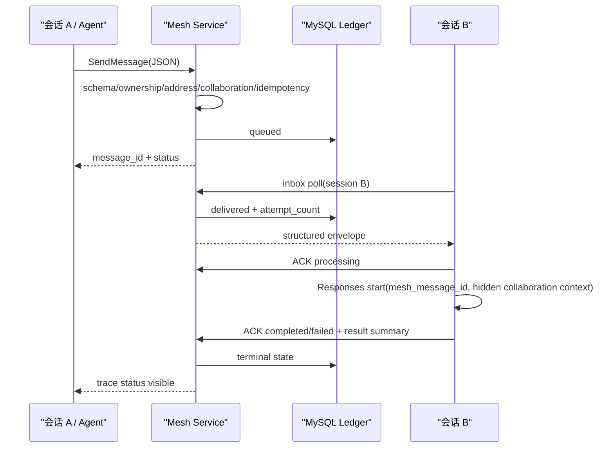

# DESIGN - 小菱多智能体总调度体系

> 阶段：Architect
> 日期：2026-08-10
> 状态：设计完成

## 1. 整体架构

## 2. 数据模型

### 2.1 `agent_mesh_conversation`

| 字段 | 类型 | 说明 |
|---|---|---|
| id | bigint | 主键 |
| user_id | bigint | 账户所有者，服务端注入 |
| surface | varchar(24) | user/admin |
| session_key | varchar(128) | 会话稳定键 |
| title | varchar(200) | 会话标题 |
| status | varchar(24) | active/archived |
| presence | varchar(24) | online/offline，由 last_seen 计算后返回 |
| active_run_id | varchar(80) | 可空，仅状态提示 |
| active_run_status | varchar(32) | 可空 |
| last_seen_at | datetime | 最近心跳 |
| last_message_at | datetime | 最近收发消息 |

唯一键：`(user_id, surface, session_key)`。

### 2.2 `agent_mesh_message`

保存标准信封、服务端所有权、投递状态和时间线。JSON 使用 MySQL LONGTEXT/SQLite Text，所有查询键单独建列，不在 JSON 上做关键路由。

关键索引：`message_id unique`、`(user_id,target_address,status,id)`、`trace_id`、`correlation_id`、`(user_id,idempotency_key) unique`。

## 3. 寻址

- `agent:<contract_code>`：32 个内置契约，运行时/服务型均可发现。
- `custom:<agent_code>`：当前用户可调用的已发布自定义 Agent。
- `session:user:<session_key>`、`session:admin:<session_key>`：当前账户会话。
- `xiaoling`：逻辑别名，根据当前 surface 解析到 `chat_assistant` 或 `manager`。

所有解析由一个服务完成，工具、REST API和前端不得各自实现字符串猜测。

## 4. API

| 方法 | 路径 | 用途 |
|---|---|---|
| POST | `/api/agent-mesh/conversations/heartbeat` | 注册/更新当前会话 |
| GET | `/api/agent-mesh/agents` | ListAgents |
| POST | `/api/agent-mesh/messages` | SendMessage |
| GET | `/api/agent-mesh/inbox` | 拉取当前会话待处理消息 |
| POST | `/api/agent-mesh/messages/{message_id}/ack` | ACK/processing/completed/failed |
| GET | `/api/agent-mesh/traces/{trace_id}` | 恢复脱敏对话链 |

所有端点依赖 `AGENT_CHAT` 权限；admin surface 额外验证管理员身份。消息正文与追踪响应执行现有递归脱敏规则。

## 5. 工具集成

- 扩展既有 `list_agents`，调用 Mesh Service，不能仅返回 `AgentRegistry`。
- 新增固定工具 `send_message`，参数模型直接生成 JSON Schema；执行器使用当前 request 的用户、surface、session 和 run trace。
- `SendMessage` 本身是消息写入，需工具审批；收到消息后真正执行的业务动作仍按原工具风险级别再次裁决。
- 内置 Agent 地址用于可视化和受控协作；本次不虚构不存在的独立进程。真正执行仍由现有 Orchestrator/Service adapter 完成。

## 6. 自动唤醒时序

## 7. 异常治理

- 幂等冲突：相同 user + idempotency_key 返回原消息，不重复投递。
- 目标离线：保持 queued；不丢弃。
- 目标 busy：拉取但不进入 processing，当前 run 终态后处理。
- 超时：超过 expires_at 标记 expired。
- 重试：failed 且 `attempt_count < max_attempts` 可重新 queued；达到上限 dead_letter。
- 进程中断：状态在数据库恢复；前端重新心跳/轮询后继续。
- 冲突：小菱按 trace 聚合多个 task.result；有互斥结论时发送 coordination 二次核对，不自动覆盖已有结果。

## 8. 前端交互

- 会话切换器改为服务端会话为主、本地快照为性能缓存；保留创建、改名、删除/归档现有体验。
- 每个会话启动心跳与收件箱轮询；组件销毁时停止轮询，不伪造在线。
- 新增 `AgentConversationTrace` 折叠控件，放入已有调用链区域，默认收起。
- 使用稳定高度、可滚动内容、窄屏单列；不新增卡片套卡片。
- 空消息不渲染；reasoning、敏感键和工具原始参数不进入 UI。

## 9. 发布与回滚

- 迁移版本：`030_agent_mesh`。
- 部署前生成并校验数据库备份，记录当前容器镜像和 release。
- 只同步本任务白名单文件，保留生产分支独有内容和 `.env`。
- 失败时切回旧 backend/frontend 镜像；数据库新表为旁路新增，不影响旧程序，可保留或执行 downgrade。
