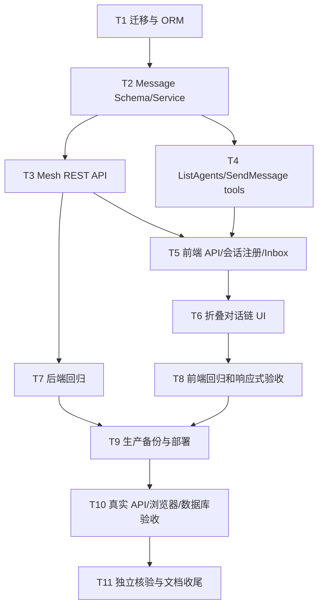

# TASK - 小菱多智能体总调度体系

> 阶段：Atomize
> 日期：2026-08-10
> 状态：已拆分

## 1. 依赖图

## 2. 原子任务

### T1 迁移与 ORM

- 输入：Alembic `029 (head)`、现有 Base/Id/Timestamp 规范。
- 输出：`030_agent_mesh.py`、Conversation/Message ORM。
- 验收：SQLite/MySQL upgrade/downgrade、索引和唯一约束测试通过。

### T2 Message Schema/Service

- 输入：`contracts.py`、MetaGPT Message、published Agent service、Responses 脱敏。
- 输出：严格 Pydantic 信封、地址解析、ListAgents、发送、inbox、ACK、trace 服务。
- 验收：正常、边界、异常、用户隔离、协作越界、幂等、过期和重试测试通过。

### T3 Mesh REST API

- 输入：T2。
- 输出：heartbeat/agents/messages/inbox/ack/traces 路由和统一 Resp。
- 验收：认证、RBAC、surface、参数限制和 OpenAPI 契约测试通过。

### T4 工具接入

- 输入：T2、固定工具契约、PrismToolExecutor。
- 输出：扩展 ListAgents、新增 SendMessage，事件带 agent_code/trace/message_id。
- 验收：模型工具 schema、审批、工具执行和检查点恢复测试通过。

### T5 前端会话注册和 Inbox

- 输入：T3/T4、现有 AgentSessionSwitcher 和两个小菱组件。
- 输出：服务端 heartbeat、收件箱轮询、busy 后处理、隐藏 mesh 上下文启动。
- 验收：在线/离线、切换、卸载、忙碌、失败重试和无伪用户消息测试通过。

### T6 折叠对话链 UI

- 输入：trace API和现有工具 timeline。
- 输出：默认折叠 Agent 对话链，用户端/管理端复用。
- 验收：展开/收起、状态、脱敏、空行、桌面端真实浏览器与移动端窄屏 CSS/组件门禁通过；移动端浏览器截图留待具备视口控制能力的设备回归。

### T7-T8 回归

- 后端：定向 pytest、扩大 pytest、Ruff、compileall、OpenAPI、迁移。
- 前端：Vitest、ESLint、vue-tsc、生产构建。
- 失败即修复，不把既有失败误报为本任务通过。

### T9 生产部署

- 输入：通过的代码与明确文件清单。
- 输出：可校验备份、构建镜像、执行迁移、滚动切换、回滚记录。
- 验收：五容器 healthy、`/healthz`、`/readyz`、HTTPS、迁移 head。

### T10 真实验收

- API：两个会话、同账户投递、跨账户阻断、ACK/trace、ListAgents 四类对象。
- 浏览器：用户端和管理端、默认折叠、自动唤醒、桌面真实页面；移动端以窄屏 CSS/组件门禁覆盖，浏览器截图作为非阻塞 TODO。
- 数据库：独立 SQL 核对消息状态、trace、幂等和用户隔离。

### T11 独立核验

- 子代理重新读取代码、测试、数据库/API结果和文档，对任务含义、数据和上线状态做独立复核。
- 输出：ACCEPTANCE、FINAL、TODO；发现错误则退回对应任务重做。

## 3. 质量门控

- 依赖无环，所有任务均可独立验证。
- 不改 `.env`、不记录密钥、不删除用户数据。
- 不新增重复职责 Agent；32 个现有契约全部可发现。
- 不绕过审批、RBAC、运维白名单和数据隔离。
