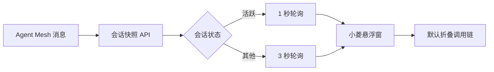
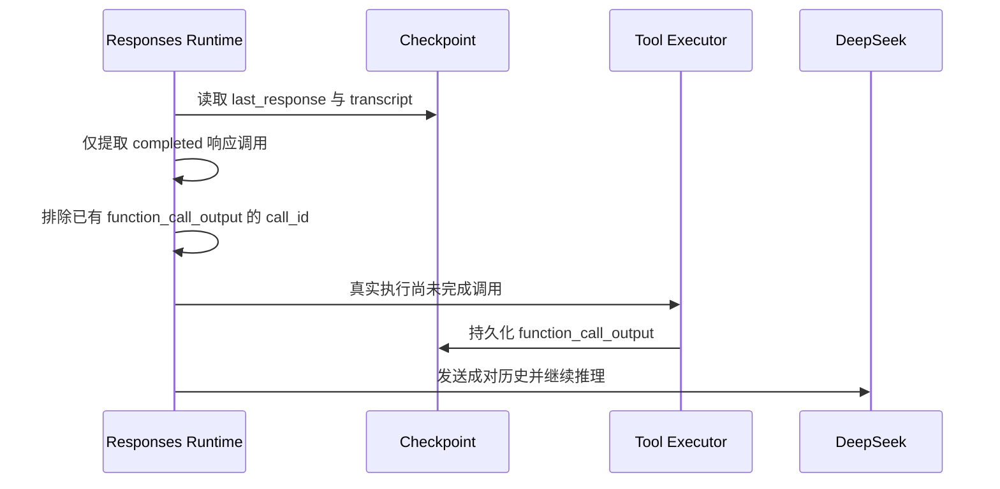

# 小菱实时刷新与 Responses 恢复 - 设计文档

## 数据流

## 中断恢复

## 异常策略

- 恢复工具再次要求审批或输入时，重新形成标准 pending 状态，不绕过人工决策。
- 工具执行异常以标准错误输出回灌模型，维持现有协议。
- 轮询瞬时失败不清空界面，按下一周期重试。
- 组件卸载、会话切换和主动停止时仍取消旧定时器并使用 generation 防止串话。
