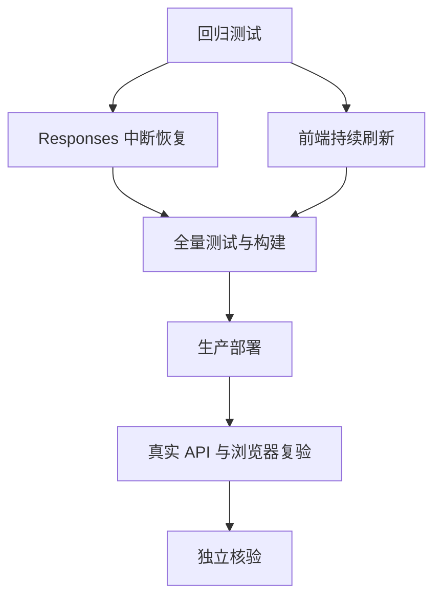

# 小菱实时刷新与 Responses 恢复 - 原子任务

## T1 回归测试

- 输入：生产失败检查点结构、现有前端会话轮询。
- 输出：精确覆盖孤立调用、失败响应禁执行、非活跃刷新和折叠通信链的测试。
- 验收：测试在实现前能暴露缺陷，实现后通过。

## T2 Responses 中断恢复

- 输入：明确完成的 `last_response` 与 transcript。
- 输出：只恢复缺少终态证据的真实调用。
- 验收：上游请求中每个恢复调用都有对应输出，且不重复执行已有调用。

## T3 前端持续刷新

- 输入：当前会话状态、组件生命周期。
- 输出：活跃 1 秒、非活跃 3 秒自适应轮询。
- 验收：管理端和用户端均实时呈现 Mesh 消息，详情默认隐藏。

## T4-T7 集成交付

- 全量执行后端测试、前端测试和生产构建。
- 备份生产版本并部署。
- 真实重试原失败运行或构造等价中断检查点；确认不再出现 400。
- 浏览器核验两端悬浮窗及默认折叠行为，最后由独立子 Agent 复核。
