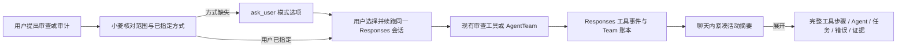

# 小菱审查方式与对话折叠设计

## 组件职责

- `agent_responses_service.py`：明确小菱在审查/审计缺模式时先询问的策略、可选值及描述；按直接审查、正式团队、项目扫描和单文件扫描的契约区分选项。
- `ResponseInputCard.vue`：沿用现有动态选项、说明、禁用自由输入和提交续跑体验。
- `ResponseToolTimeline.vue`：新增总览折叠状态；折叠摘要聚合真实步骤数、运行/等待/失败/完成状态，失败步骤名称仍可见；展开区域保留阶段、错误详情和完整工具结果。
- `AgentTeamTrace.vue`：在折叠卡片头部显示账本完成比例、状态、失败/阻塞数；展开区仍按现有分页展示成员/任务/事件/消息。
- `AgentTeamWindow.vue` 维持详细审查工作窗，不改其已有职责。

## 交互与异常

- 选择项采用后端契约原值；选择后由现有 Responses `ask_user` 续跑。
- 工具状态缺失或 Team 总数为 0 时不伪造百分比；轮询同步失败显示“同步中断”并保留上次数据。
- `failed` 与 `blocked` 数不并入完成数；错误摘要始终可见，完整错误展开可查。
- 收起/展开按钮提供 `aria-expanded` 和稳定焦点，响应减少动态效果偏好；小屏允许摘要自然换行。
- 展示折叠不改变模型上下文压缩策略、工具输出长度和持久化格式。
