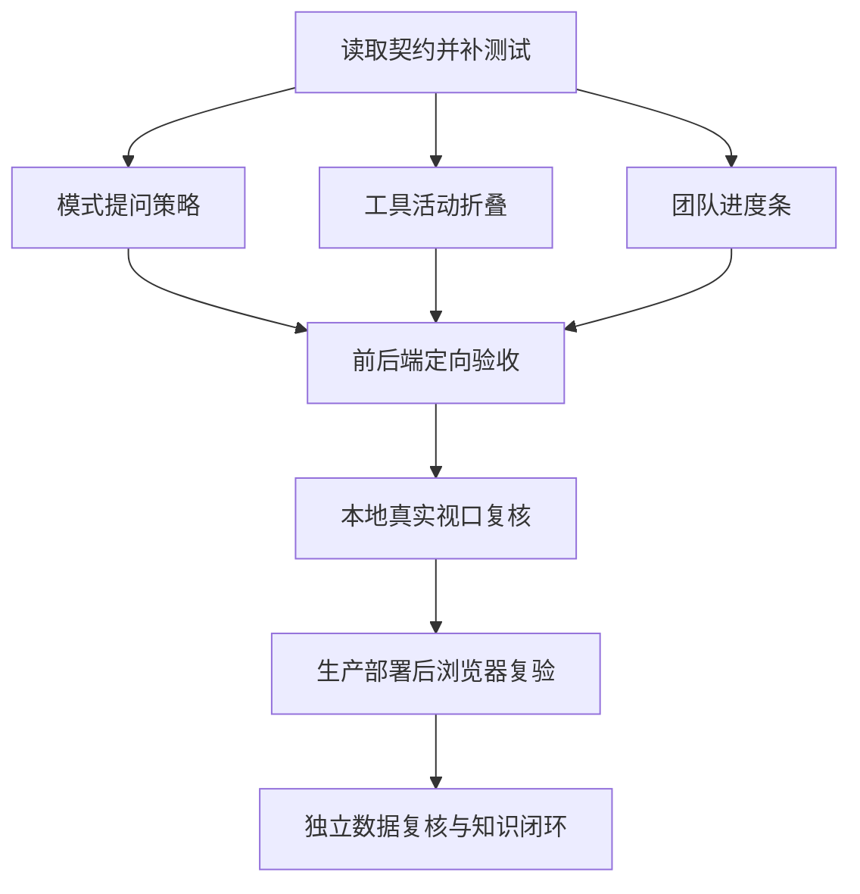

# 小菱审查方式与对话折叠任务

|任务|输入|输出与验收|依赖|
|---|---|---|---|
|模式映射与提问|Responses 提示、固定工具契约、AgentTeam 输入契约|缺少方式先问；答案精确映射支持参数；无副作用查询不问|对齐与共识|
|工具活动折叠|`ResponseToolTimeline` 事件模型|默认紧凑摘要、失败/待确认可见、展开保留完整证据、键盘可操作|现有事件模型|
|团队进度摘要|AgentTeam 账本 counts/status|卡片内真实百分比与失败计数、展开团队树|现有轮询/账本|
|回归与视觉验证|前端/后端定向测试、窄屏视口|正常/失败/零总数/待确认/同步异常覆盖；构建通过|以上任务|
|证据与知识闭环|生产截图、Safari 实测、知识收据|事实边界准确；更新现有 C20-C22 记录及明确 UI 偏好|验证完成|

当前候选分支的其它未提交修改属于在先工作，本任务只追加定向改动，不重置或覆盖它们。
