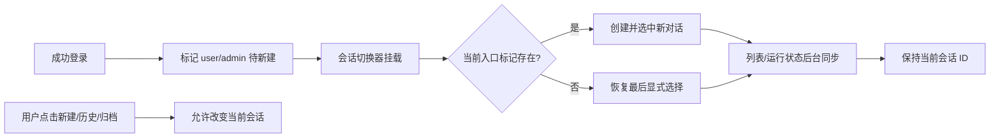

# 设计：小菱登录新对话与防自动切换修复

## 生命周期设计

## 组件职责

### `agentChatSessions.ts`

- 提供成功登录时设置两个入口标记的函数。
- 提供按入口一次性消费标记的函数。
- 存储失败时降级为当前挂载仍可用，不触碰历史数据。

### `user.ts`

- 仅在凭据登录成功、Token 和用户信息写入后设置标记。
- `fetchProfile()` 只是恢复同一认证会话，不设置标记。

### `AgentSessionSwitcher.vue`

- 挂载时先读取本地历史；有待新建标记则创建新会话并作为当前项。
- `ensureFreshOnOpen()` 只同步远端状态，不主动选择忙碌、空白或最近会话。
- `refreshFromAgentMesh()` 保留当前项并合并服务端目录，不使用 `last_seen_at` 聚焦。
- `focusSession()` 不再对外暴露，防止后台路径绕过用户选择权。

### 普通端与管理端宿主

- 后台 Mesh 消息照常执行、等待、重试、落状态。
- 完成后仅释放 busy 状态，不调用会话选择。

## 异常处理

- Agent Mesh 发现失败：保留本地列表和当前会话，下个周期重试。
- 新会话首次心跳未落库：继续通过 `pendingHeartbeatId` 保留，避免被发现结果清除。
- 当前项被用户归档：沿用显式归档后的后继选择。
- `sessionStorage` 不可用：不破坏登录和历史恢复，组件退化为原当前会话。
