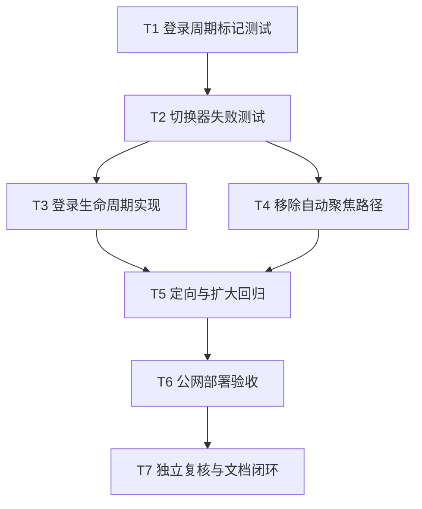

# 任务：小菱登录新对话与防自动切换修复

## 依赖图

## 原子任务

| 任务 | 输入契约 | 输出契约 | 验收 |
|---|---|---|---|
| T1 | 现有用户 Store 与会话工具 | 登录标记失败测试 | 登录设置、恢复不设置、分入口消费 |
| T2 | 已复现的三条自动聚焦路径 | 切换器失败测试 | 新建后轮询不切、忙碌不切、同次重挂载不新建 |
| T3 | T1 | 一次性登录新会话实现 | 每次成功登录一次，历史不删 |
| T4 | T2 | 移除打开/轮询/后台完成自动聚焦 | 仅用户动作切换 |
| T5 | T3/T4 | 自动化验证记录 | 测试、类型、Lint、构建无错 |
| T6 | T5 | 新生产镜像与浏览器证据 | 双镜像健康，公网时间窗复验通过 |
| T7 | 全部结果 | ACCEPTANCE/FINAL/TODO | 任务语义与数据经独立复核 |

## 实现约束

- 测试先于实现。
- 不改后端和数据库。
- 不删除历史会话，不清空浏览器存储。
- 不取消后台任务、Mesh 同步、团队卡片或恢复逻辑。
