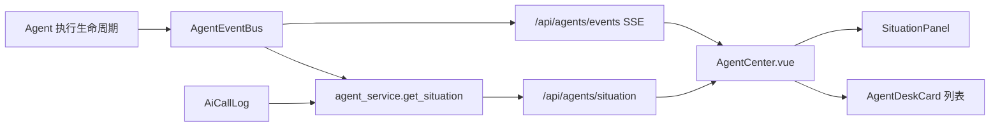
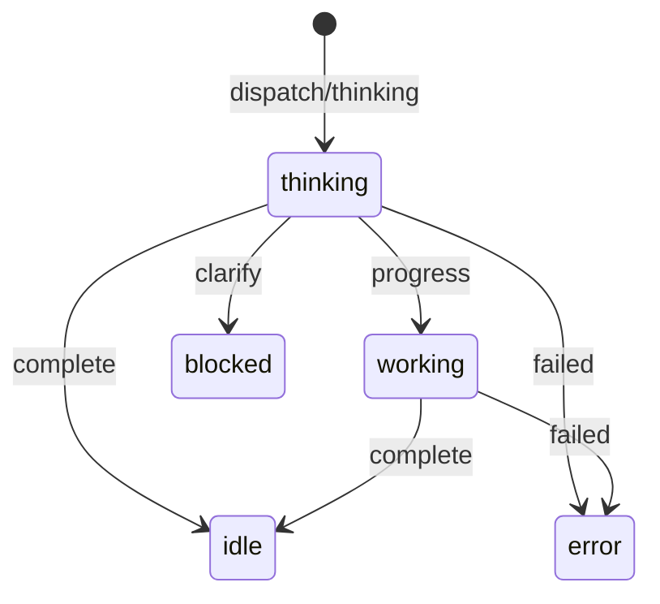

# Design：态势感知实时准确刷新

## 架构图

## 分层设计

- 事件层：`AgentEventBus` 保留所有生命周期事件，服务层只消费 recent 历史。
- 服务层：`get_situation` 负责 DB 聚合和运行状态推导。
- API 层：保持 `/api/agents/situation` 合约不变。
- 前端页面层：`AgentCenter.vue` 负责 SSE 状态合并、统计刷新和列表排序。
- 前端展示层：`SituationPanel.vue` 仅展示传入数据。

## 状态推导

后端 `working` 只统计最新事件为 `dispatch/thinking/progress` 且未超过活动窗口的 Agent；`complete/failed/clarify` 作为终止或非工作态事件。

## 排序策略

- `working` 优先级最高。
- `thinking` 次之。
- `blocked/error` 保持在空闲前，便于观察异常或等待态。
- `idle/offline` 靠后。
- 同优先级使用注册中心返回顺序，避免列表无意义抖动。
