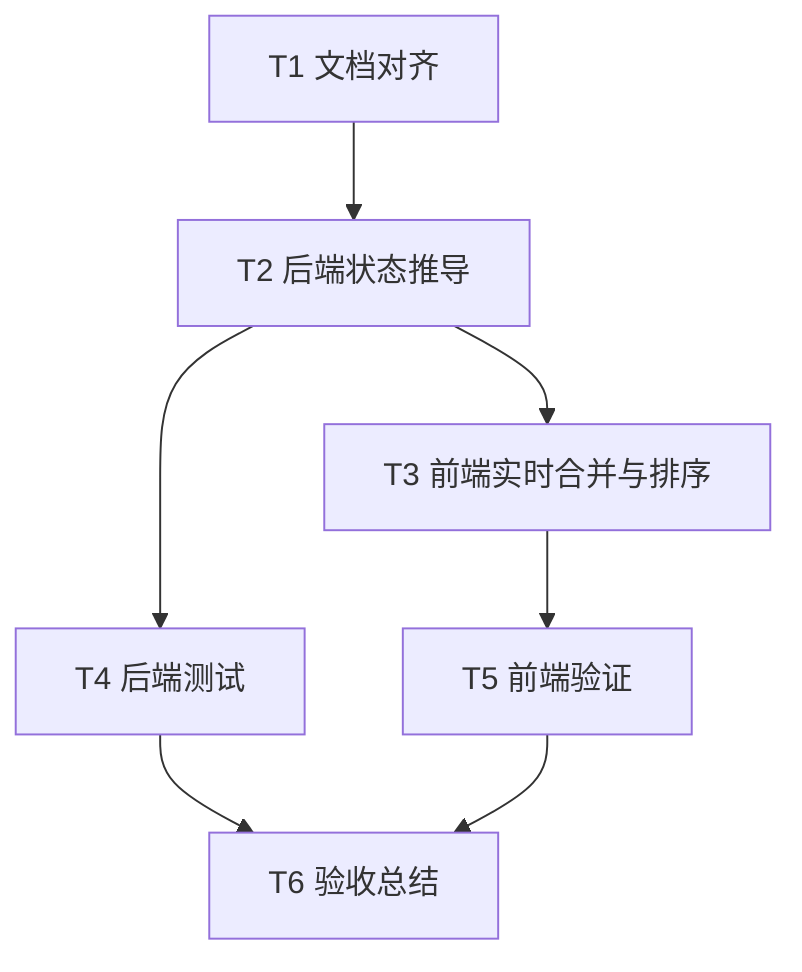

# Task：态势感知实时准确刷新

## T1 文档对齐

- 输入：用户需求、现有项目文档、Agent 中心代码。
- 输出：ALIGNMENT、CONSENSUS、DESIGN、TASK 文档。
- 验收：任务边界明确，不扩大到无关业务。

## T2 后端状态推导

- 输入：`AgentEventBus.recent()`、`AgentRegistry.list_runtime()`。
- 输出：准确的 `working/idle` 统计。
- 验收：完成或失败事件会覆盖旧的进行中事件。

## T3 前端实时合并与排序

- 输入：SSE AgentEvent、`runtime` 和 `situation` 状态。
- 输出：实时更新的态势面板和工作态优先的 Agent 列表。
- 验收：工作中 Agent 自动前置，完成后回到基础排序。

## T4 后端测试

- 输入：伪造事件和伪造 DB。
- 输出：覆盖工作中、完成覆盖、失败覆盖的单元测试。
- 验收：目标测试通过。

## T5 前端验证

- 输入：TypeScript/Vite 项目。
- 输出：类型检查与构建结果。
- 验收：`npm run build` 通过。

## T6 验收总结

- 输入：代码改动和验证结果。
- 输出：ACCEPTANCE、FINAL、TODO 和说明文档进度。
- 验收：交付物完整，待办清晰。
